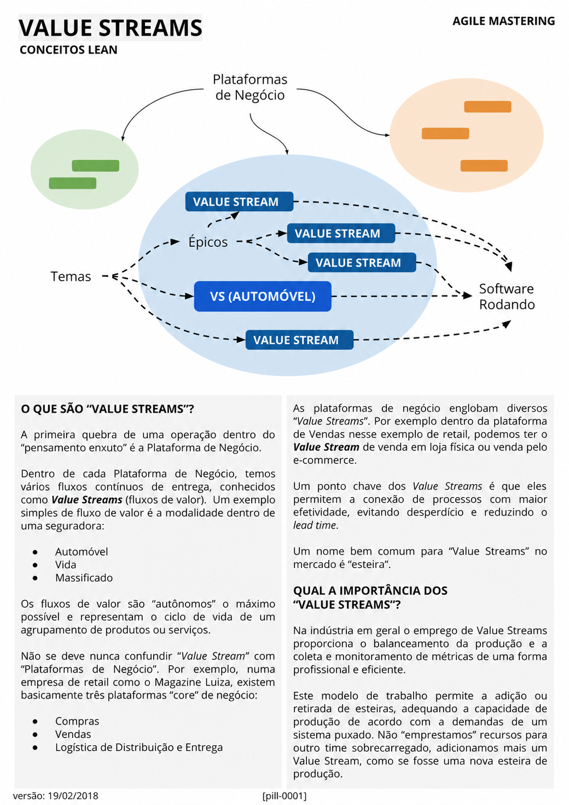

# Value Streams

<figure class="agile-pill-facsimile">
  
  <figcaption>Composição visual original da pill 0001.</figcaption>
</figure>

## Transcrição textual

## O que são “Value Streams”?

A primeira quebra de uma operação dentro do “pensamento enxuto” é a Plataforma de Negócio. Dentro de cada
Plataforma de Negócio, temos vários fluxos contínuos de entrega, conhecidos como Value Streams (fluxos de
valor). Um exemplo simples de fluxo de valor é a modalidade dentro de uma seguradora:

- Automóvel
- Vida
- Massificado

Os fluxos de valor são “autônomos” o máximo possível e representam o ciclo de vida de um agrupamento de
produtos ou serviços.

Não se deve nunca confundir “Value Stream” com “Plataformas de Negócio”. Por exemplo, numa empresa de retail
como o Magazine Luiza, existem basicamente três plataformas “core” de negócio:

- Compras
- Vendas
- Logística de Distribuição e Entrega

As plataformas de negócio englobam diversos “Value Streams”. Por exemplo, dentro da plataforma de Vendas
nesse exemplo de retail, podemos ter o Value Stream de venda em loja física ou venda pelo e-commerce.

Um ponto chave dos Value Streams é que eles permitem a conexão de processos com maior efetividade, evitando
desperdício e reduzindo o lead time.

Um nome bem comum para “Value Streams” no mercado é “esteira”.

## Qual a importância dos “Value Streams”?

Na indústria em geral o emprego de Value Streams proporciona o balanceamento da produção e a coleta e
monitoramento de métricas de uma forma profissional e eficiente.

Este modelo de trabalho permite a adição ou retirada de esteiras, adequando a capacidade de produção de
acordo com a demandas de um sistema puxado. Não “emprestamos” recursos para outro time sobrecarregado,
adicionamos mais um Value Stream, como se fosse uma nova esteira de produção.

## Anotações editoriais

- O texto acima foi preservado conforme a pill original, com ajustes apenas de diagramação para Markdown.
- Um fluxo de valor não precisa coincidir com uma estrutura organizacional fixa. Adicionar capacidade ou
  criar outro time é uma decisão contextual, não uma consequência automática do conceito.
- Conteúdo relacionado: [Gestão do Fluxo de Valor]({{ site.baseurl }}/Conceitos-Ágeis/Gestão-do-Fluxo-de-Valor.html).

**Proveniência:** `[pill-0001]`, versão de 19/02/2018. Anotações adicionadas em 2026.
