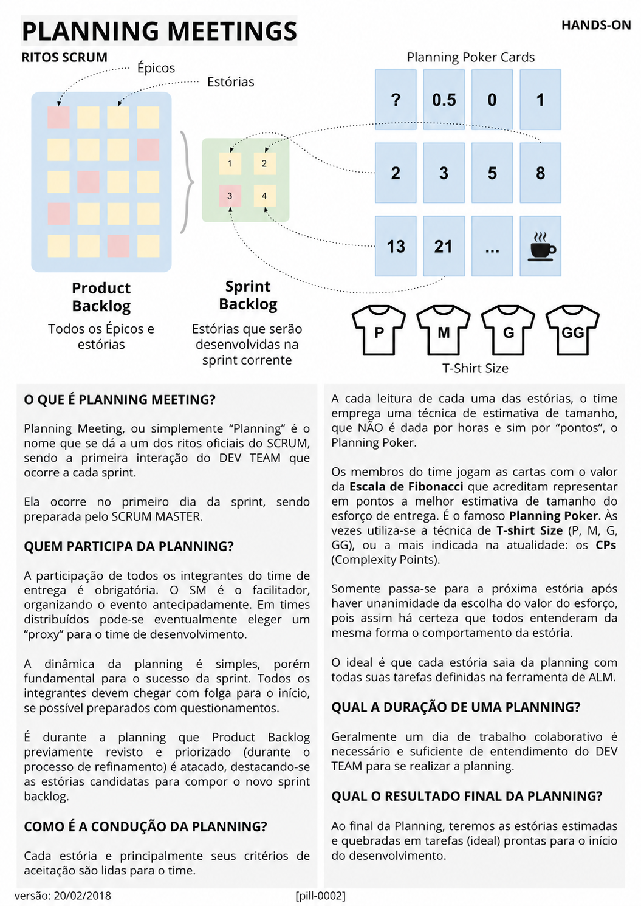

# Planning Meetings

<figure class="agile-pill-facsimile">
  
  <figcaption>Composição visual original da pill 0002.</figcaption>
</figure>

## Transcrição textual

## O que é Planning Meeting?

Planning Meeting, ou simplemente “Planning” é o nome que se dá a um dos ritos oficiais do SCRUM, sendo a
primeira interação do DEV TEAM que ocorre a cada sprint.

Ela ocorre no primeiro dia da sprint, sendo preparada pelo SCRUM MASTER.

## Quem participa da Planning?

A participação de todos os integrantes do time de entrega é obrigatória. O SM é o facilitador, organizando
o evento antecipadamente. Em times distribuídos pode-se eventualmente eleger um “proxy” para o time de
desenvolvimento.

A dinâmica da planning é simples, porém fundamental para o sucesso da sprint. Todos os integrantes devem
chegar com folga para o início, se possível preparados com questionamentos.

É durante a planning que Product Backlog previamente revisto e priorizado (durante o processo de refinamento)
é atacado, destacando-se as estórias candidatas para compor o novo sprint backlog.

## Como é a condução da Planning?

Cada estória e principalmente seus critérios de aceitação são lidas para o time.

A cada leitura de cada uma das estórias, o time emprega uma técnica de estimativa de tamanho, que NÃO é dada
por horas e sim por “pontos”, o Planning Poker.

Os membros do time jogam as cartas com o valor da Escala de Fibonacci que acreditam representar em pontos a
melhor estimativa de tamanho do esforço de entrega. É o famoso Planning Poker. Às vezes utiliza-se a técnica
de T-shirt Size (P, M, G, GG), ou a mais indicada na atualidade: os CPs (Complexity Points).

Somente passa-se para a próxima estória após haver unanimidade da escolha do valor do esforço, pois assim há
certeza que todos entenderam da mesma forma o comportamento da estória.

O ideal é que cada estória saia da planning com todas suas tarefas definidas na ferramenta de ALM.

## Qual a duração de uma Planning?

Geralmente um dia de trabalho colaborativo é necessário e suficiente de entendimento do DEV TEAM para se
realizar a planning.

## Qual o resultado final da Planning?

Ao final da Planning, teremos as estórias estimadas e quebradas em tarefas (ideal) prontas para o início do
desenvolvimento.

## Anotações editoriais

- O Scrum Guide 2020 chama o evento de **Sprint Planning**, usa **Developers** no lugar de “Dev Team” e
  organiza a conversa em por quê, o quê e como.
- Planning Poker, Fibonacci, pontos, unanimidade e decomposição prévia de todas as tarefas são práticas
  possíveis, mas não regras do Scrum.
- O timebox máximo é de oito horas para uma Sprint de um mês; Sprints menores normalmente exigem menos tempo.
- Referência: [Scrum Guide oficial](https://scrumguides.org/scrum-guide.html).

**Proveniência:** `[pill-0002]`, versão de 20/02/2018. Anotações adicionadas em 2026.
