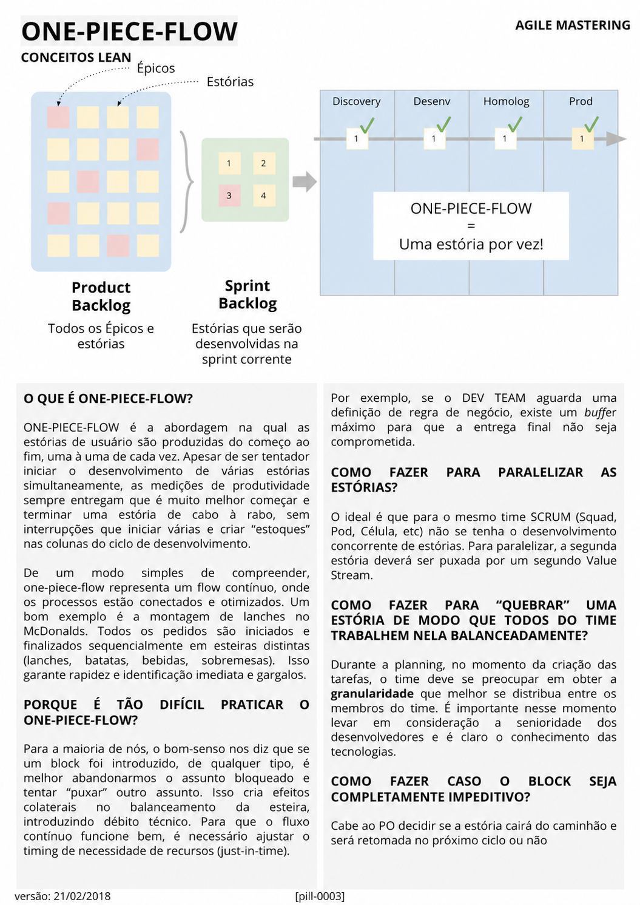

# One-Piece Flow

<figure class="agile-pill-facsimile">
  
  <figcaption>Composição visual original da pill 0003.</figcaption>
</figure>

## Transcrição textual

## O que é One-Piece Flow?

ONE-PIECE-FLOW é a abordagem na qual as estórias de usuário são produzidas do começo ao fim, uma à uma de
cada vez. Apesar de ser tentador iniciar o desenvolvimento de várias estórias simultaneamente, as medições
de produtividade sempre entregam que é muito melhor começar e terminar uma estória de cabo à rabo, sem
interrupções que iniciar várias e criar “estoques” nas colunas do ciclo de desenvolvimento.

De um modo simples de compreender, one-piece-flow representa um flow contínuo, onde os processos estão
conectados e otimizados. Um bom exemplo é a montagem de lanches no McDonalds. Todos os pedidos são iniciados
e finalizados sequencialmente em esteiras distintas (lanches, batatas, bebidas, sobremesas). Isso garante
rapidez e identificação imediata e gargalos.

## Porque é tão difícil praticar o One-Piece Flow?

Para a maioria de nós, o bom-senso nos diz que se um block foi introduzido, de qualquer tipo, é melhor
abandonarmos o assunto bloqueado e tentar “puxar” outro assunto. Isso cria efeitos colaterais no balanceamento
da esteira, introduzindo débito técnico. Para que o fluxo contínuo funcione bem, é necessário ajustar o timing
de necessidade de recursos (just-in-time).

Por exemplo, se o DEV TEAM aguarda uma definição de regra de negócio, existe um buffer máximo para que a
entrega final não seja comprometida.

## Como fazer para paralelizar as estórias?

O ideal é que para o mesmo time SCRUM (Squad, Pod, Célula, etc) não se tenha o desenvolvimento concorrente de
estórias. Para paralelizar, a segunda estória deverá ser puxada por um segundo Value Stream.

## Como fazer para “quebrar” uma estória de modo que todos do time trabalhem nela balanceadamente?

Durante a planning, no momento da criação das tarefas, o time deve se preocupar em obter a granularidade que
melhor se distribua entre os membros do time. É importante nesse momento levar em consideração a senioridade
dos desenvolvedores e é claro o conhecimento das tecnologias.

## Como fazer caso o block seja completamente impeditivo?

Cabe ao PO decidir se a estória cairá do caminhão e será retomada no próximo ciclo ou não.

## Anotações editoriais

- O texto original associa paralelização à criação de outro Value Stream. Na prática, um fluxo de valor é
  uma visão ponta a ponta; paralelismo e desenho de times são decisões distintas.
- One-piece flow é uma direção de melhoria. Em trabalho do conhecimento, limites explícitos de WIP e
  colaboração sobre poucos itens costumam ser mais realistas do que exigir literalmente uma única história.
- Quando há bloqueio, o Product Owner não decide sozinho todo o plano da Sprint; Developers administram o
  Sprint Backlog e colaboram com o Product Owner quando o escopo precisa ser renegociado.

**Proveniência:** `[pill-0003]`, versão de 21/02/2018. Anotações adicionadas em 2026.
