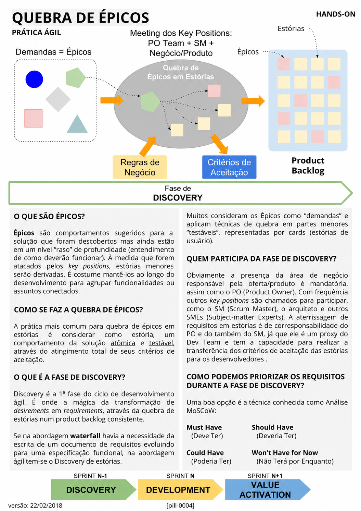

# Quebra de Épicos

<figure class="agile-pill-facsimile">
  
  <figcaption>Composição visual original da pill 0004.</figcaption>
</figure>

## Transcrição textual

## O que são épicos?

Épicos são comportamentos sugeridos para a solução que foram descobertos mas ainda estão em um nível “raso”
de profundidade (entendimento de como deverão funcionar). À medida que forem atacados pelos key positions,
estórias menores serão derivadas. É costume mantê-los ao longo do desenvolvimento para agrupar funcionalidades
ou assuntos conectados.

## Como se faz a quebra de épicos?

A prática mais comum para quebra de épicos em estórias é considerar como estória, um comportamento da solução
atômica e testável, através do atingimento total de seus critérios de aceitação.

## O que é a fase de Discovery?

Discovery é a 1ª fase do ciclo de desenvolvimento ágil. É onde a mágica da transformação de desirements em
requirements, através da quebra de estórias num product backlog consistente.

Se na abordagem waterfall havia a necessidade da escrita de um documento de requisitos evoluindo para uma
especificação funcional, na abordagem ágil tem-se o Discovery de estórias.

Muitos consideram os Épicos como “demandas” e aplicam técnicas de quebra em partes menores “testáveis”,
representadas por cards (estórias de usuário).

## Quem participa da fase de Discovery?

Obviamente a presença da área de negócio responsável pela oferta/produto é mandatória, assim como o PO
(Product Owner). Com frequência outros key positions são chamados para participar, como o SM (Scrum Master),
o arquiteto e outros SMEs (Subject-matter Experts). A aterrissagem de requisitos em estórias é de
corresponsabilidade do PO e do também do SM, já que ele é um proxy do Dev Team e tem a capacidade para realizar
a transferência dos critérios de aceitação das estórias para os desenvolvedores.

## Como podemos priorizar os requisitos durante a fase de Discovery?

Uma boa opção é a técnica conhecida como Análise MoSCoW:

- Must Have (Deve Ter)
- Should Have (Deveria Ter)
- Could Have (Poderia Ter)
- Won’t Have for Now (Não Terá por Enquanto)

## Anotações editoriais

- Discovery não é uma fase prescrita pelo Scrum nem precisa anteceder toda a entrega de forma sequencial.
- O Scrum Master não é “proxy do Dev Team” e não tem como responsabilidade transferir critérios para os
  Developers. A colaboração direta reduz perda de contexto.
- Épico, história de usuário e MoSCoW são práticas complementares, não elementos definidos pelo Scrum Guide.
- Conteúdo relacionado: [Discovery e Delivery]({{ site.baseurl }}/Conceitos-Ágeis/Discovery-&-Delivery.html).

**Proveniência:** `[pill-0004]`, versão de 22/02/2018. Anotações adicionadas em 2026.
