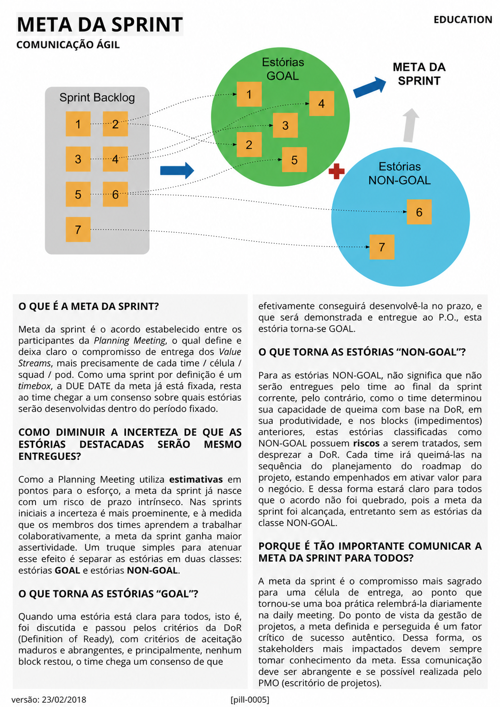

# Meta da Sprint

<figure class="agile-pill-facsimile">
  
  <figcaption>Composição visual original da pill 0005.</figcaption>
</figure>

## Transcrição textual

## O que é a Meta da Sprint?

Meta da sprint é o acordo estabelecido entre os participantes da Planning Meeting, o qual define e deixa
claro o compromisso de entrega dos Value Streams, mais precisamente de cada time / célula / squad / pod.
Como uma sprint por definição é um timebox, a DUE DATE da meta já está fixada, resta ao time chegar a um
consenso sobre quais estórias serão desenvolvidas dentro do período fixado.

## Como diminuir a incerteza de que as estórias destacadas serão mesmo entregues?

Como a Planning Meeting utiliza estimativas em pontos para o esforço, a meta da sprint já nasce com um risco
de prazo intrínseco. Nas sprints iniciais a incerteza é mais proeminente, e à medida que os membros dos times
aprendem a trabalhar colaborativamente, a meta da sprint ganha maior assertividade. Um truque simples para
atenuar esse efeito é separar as estórias em duas classes: estórias GOAL e estórias NON-GOAL.

## O que torna as estórias “GOAL”?

Quando uma estória está clara para todos, isto é, foi discutida e passou pelos critérios da DoR (Definition
of Ready), com critérios de aceitação maduros e abrangentes, e principalmente, nenhum block restou, o time
chega um consenso de que efetivamente conseguirá desenvolvê-la no prazo, e que será demonstrada e entregue
ao P.O., esta estória torna-se GOAL.

## O que torna as estórias “NON-GOAL”?

Para as estórias NON-GOAL, não significa que não serão entregues pelo time ao final da sprint corrente, pelo
contrário, como o time determinou sua capacidade de queima com base na DoR, em sua produtividade, e nos blocks
(impedimentos) anteriores, estas estórias classificadas como NON-GOAL possuem riscos a serem tratados, sem
desprezar a DoR. Cada time irá queimá-las na sequência do planejamento do roadmap do projeto, estando
empenhados em ativar valor para o negócio. E dessa forma estará claro para todos que o acordo não foi
quebrado, pois a meta da sprint foi alcançada, entretanto sem as estórias da classe NON-GOAL.

## Porque é tão importante comunicar a Meta da Sprint para todos?

A meta da sprint é o compromisso mais sagrado para uma célula de entrega, ao ponto que tornou-se uma boa
prática relembrá-la diariamente na daily meeting. Do ponto de vista da gestão de projetos, a meta definida e
perseguida é um fator crítico de sucesso autêntico. Dessa forma, os stakeholders mais impactados devem sempre
tomar conhecimento da meta. Essa comunicação deve ser abrangente e se possível realizada pelo PMO
(escritório de projetos).

## Anotações editoriais

- No Scrum Guide 2020, a Meta da Sprint é o único objetivo da Sprint e constitui um compromisso do Sprint
  Backlog; ela não equivale a prometer um conjunto fixo de histórias.
- “Goal” e “non-goal” podem ser uma política local, mas não são categorias do Scrum. Definition of Ready
  também é prática opcional.
- A comunicação não precisa ser realizada por um PMO. O Scrum Team mantém transparência com stakeholders de
  acordo com o contexto.
- Conteúdo relacionado: [Meta da Sprint]({{ site.baseurl }}/Conceitos-Ágeis/Scrum/Meta-da-Sprint.html).

**Proveniência:** `[pill-0005]`, versão de 23/02/2018. Anotações adicionadas em 2026.
