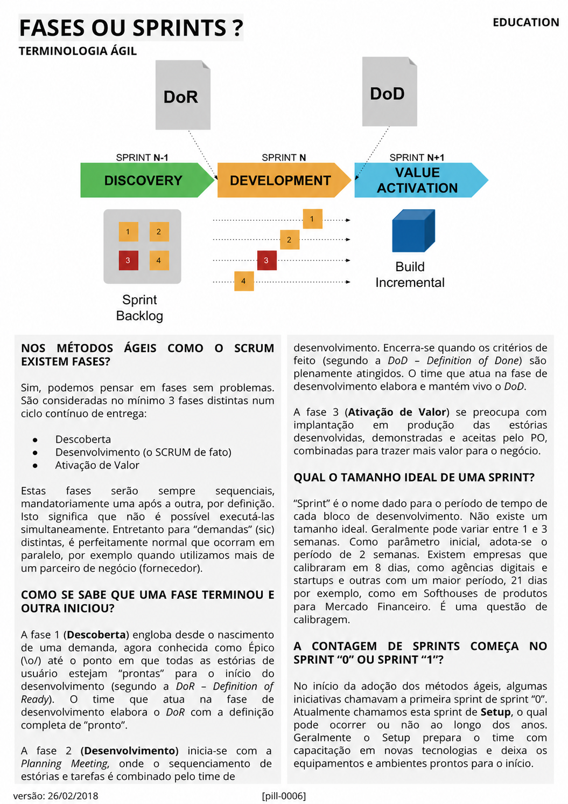

# Fases ou Sprints?

<figure class="agile-pill-facsimile">
  
  <figcaption>Composição visual original da pill 0006.</figcaption>
</figure>

## Transcrição textual

## Nos métodos ágeis como o Scrum existem fases?

Sim, podemos pensar em fases sem problemas. São consideradas no mínimo 3 fases distintas num ciclo contínuo
de entrega:

- Descoberta
- Desenvolvimento (o SCRUM de fato)
- Ativação de Valor

Estas fases serão sempre sequenciais, mandatoriamente uma após a outra, por definição. Isto significa que não
é possível executá-las simultaneamente. Entretanto para “demandas” (sic) distintas, é perfeitamente normal
que ocorram em paralelo, por exemplo quando utilizamos mais de um parceiro de negócio (fornecedor).

## Como se sabe que uma fase terminou e outra iniciou?

A fase 1 (Descoberta) engloba desde o nascimento de uma demanda, agora conhecida como Épico (\o/) até o ponto
em que todas as estórias de usuário estejam “prontas” para o início do desenvolvimento (segundo a DoR –
Definition of Ready). O time que atua na fase de desenvolvimento elabora o DoR com a definição completa de
“pronto”.

A fase 2 (Desenvolvimento) inicia-se com a Planning Meeting, onde o sequenciamento de estórias e tarefas é
combinado pelo time de desenvolvimento. Encerra-se quando os critérios de feito (segundo a DoD – Definition
of Done) são plenamente atingidos. O time que atua na fase de desenvolvimento elabora e mantém vivo o DoD.

A fase 3 (Ativação de Valor) se preocupa com implantação em produção das estórias desenvolvidas, demonstradas
e aceitas pelo PO, combinadas para trazer mais valor para o negócio.

## Qual o tamanho ideal de uma Sprint?

“Sprint” é o nome dado para o período de tempo de cada bloco de desenvolvimento. Não existe um tamanho ideal.
Geralmente pode variar entre 1 e 3 semanas. Como parâmetro inicial, adota-se o período de 2 semanas. Existem
empresas que calibraram em 8 dias, como agências digitais e startups e outras com um maior período, 21 dias
por exemplo, como em Softhouses de produtos para Mercado Financeiro. É uma questão de calibragem.

## A contagem de Sprints começa no Sprint “0” ou Sprint “1”?

No início da adoção dos métodos ágeis, algumas iniciativas chamavam a primeira sprint de sprint “0”.
Atualmente chamamos esta sprint de Setup, o qual pode ocorrer ou não ao longo dos anos.

Geralmente o Setup prepara o time com capacitação em novas tecnologias e deixa os equipamentos e ambientes
prontos para o início.

## Anotações editoriais

- Discovery, desenvolvimento e ativação de valor não são fases prescritas pelo Scrum e não precisam ser
  sequenciais. Diferentes tipos de trabalho podem ocorrer continuamente e de forma sobreposta.
- No Scrum Guide 2020, uma Sprint tem duração fixa de **um mês ou menos**.
- “Sprint zero”, Setup e Definition of Ready não são elementos definidos pelo Scrum Guide.
- Conteúdo relacionado: [Gestão do Fluxo de Valor]({{ site.baseurl }}/Conceitos-Ágeis/Gestão-do-Fluxo-de-Valor.html).

**Proveniência:** `[pill-0006]`, versão de 26/02/2018. Anotações adicionadas em 2026.
