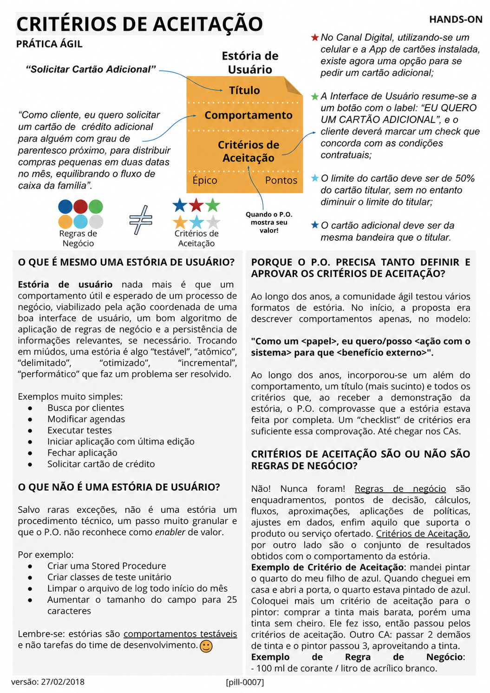

# Critérios de Aceitação

<figure class="agile-pill-facsimile">
  
  <figcaption>Composição visual original da pill 0007.</figcaption>
</figure>

## Transcrição textual

## O que é mesmo uma estória de usuário?

Estória de usuário nada mais é que um comportamento útil e esperado de um processo de negócio, viabilizado
pela ação coordenada de uma boa interface de usuário, um bom algoritmo de aplicação de regras de negócio e a
persistência de informações relevantes, se necessário. Trocando em miúdos, uma estória é algo “testável”,
“atômico”, “delimitado”, “otimizado”, “incremental”, “performático” que faz um problema ser resolvido.

Exemplos muito simples:

- Busca por clientes
- Modificar agendas
- Executar testes
- Iniciar aplicação com última edição
- Fechar aplicação
- Solicitar cartão de crédito

## O que não é uma estória de usuário?

Salvo raras exceções, não é uma estória um procedimento técnico, um passo muito granular e que o P.O. não
reconhece como enabler de valor. Por exemplo:

- Criar uma Stored Procedure
- Criar classes de teste unitário
- Limpar o arquivo de log todo início do mês
- Aumentar o tamanho do campo para 25 caracteres

Lembre-se: estórias são comportamentos testáveis e não tarefas do time de desenvolvimento.

## Porque o P.O. precisa tanto definir e aprovar os critérios de aceitação?

Ao longo dos anos, a comunidade ágil testou vários formatos de estória. No início, a proposta era descrever
comportamentos apenas, no modelo:

> “Como um &lt;papel&gt;, eu quero/posso &lt;ação com o sistema&gt; para que &lt;benefício externo&gt;”.

Ao longo dos anos, incorporou-se um além do comportamento, um título (mais sucinto) e todos os critérios que,
ao receber a demonstração da estória, o P.O. comprovasse que a estória estava feita por completa. Um
“checklist” de critérios era suficiente essa comprovação. Até chegar nos CAs.

## Critérios de Aceitação são ou não são regras de negócio?

Não! Nunca foram! Regras de negócio são enquadramentos, pontos de decisão, cálculos, fluxos, aproximações,
aplicações de políticas, ajustes em dados, enfim aquilo que suporta o produto ou serviço ofertado. Critérios
de Aceitação, por outro lado são o conjunto de resultados obtidos com o comportamento da estória.

**Exemplo de Critério de Aceitação:** mandei pintar o quarto do meu filho de azul. Quando cheguei em casa e
abri a porta, o quarto estava pintado de azul. Coloquei mais um critério de aceitação para o pintor: comprar a
tinta mais barata, porém uma tinta sem cheiro. Ele fez isso, então passou pelos critérios de aceitação. Outro
CA: passar 2 demãos de tinta e o pintor passou 3, aproveitando a tinta.

**Exemplo de Regra de Negócio:** 100 ml de corante / litro de acrílico branco.

## Exemplo da pill

**Título:** Solicitar Cartão Adicional.

**Comportamento:** “Como cliente, eu quero solicitar um cartão de crédito adicional para alguém com grau de
parentesco próximo, para distribuir compras pequenas em duas datas no mês, equilibrando o fluxo de caixa da
família”.

**Critérios de aceitação:**

- No Canal Digital, utilizando-se um celular e a App de cartões instalada, existe agora uma opção para se
  pedir um cartão adicional;
- a Interface de Usuário resume-se a um botão com o label “EU QUERO UM CARTÃO ADICIONAL”, e o cliente deverá
  marcar um check que concorda com as condições contratuais;
- o limite do cartão deve ser de 50% do cartão titular, sem no entanto diminuir o limite do titular;
- o cartão adicional deve ser da mesma bandeira que o titular.

## Anotações editoriais

- Histórias de usuário e seu formato são práticas complementares; não são exigências do Scrum.
- Trabalho técnico também pode ser representado e gerenciado quando necessário. O critério relevante é a
  transparência sobre seu valor, risco ou necessidade, não a proibição de registrá-lo.
- Critérios de aceitação podem expressar exemplos de regras de negócio; a separação entre os dois conceitos
  não é absoluta como afirma o texto original.
- Conteúdo relacionado: [Critérios de Aceite]({{ site.baseurl }}/Conceitos-Ágeis/BDD/Critérios-de-Aceite.html).

**Proveniência:** `[pill-0007]`, versão de 27/02/2018. Anotações adicionadas em 2026.
