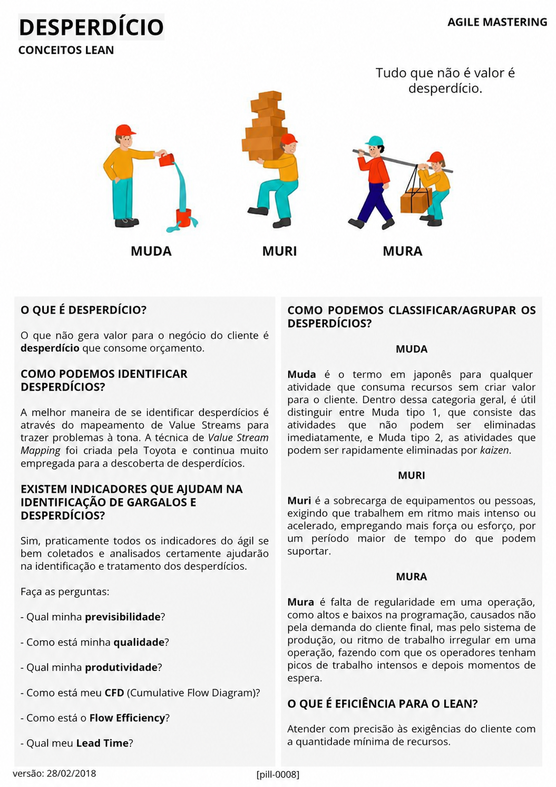

# Desperdício

<figure class="agile-pill-facsimile">
  
  <figcaption>Composição visual original da pill 0008.</figcaption>
</figure>

## Transcrição textual

## O que é desperdício?

O que não gera valor para o negócio do cliente é desperdício que consome orçamento.

## Como podemos identificar desperdícios?

A melhor maneira de se identificar desperdícios é através do mapeamento de Value Streams para trazer
problemas à tona. A técnica de Value Stream Mapping foi criada pela Toyota e continua muito empregada para a
descoberta de desperdícios.

## Existem indicadores que ajudam na identificação de gargalos e desperdícios?

Sim, praticamente todos os indicadores do ágil se bem coletados e analisados certamente ajudarão na
identificação e tratamento dos desperdícios.

Faça as perguntas:

- Qual minha previsibilidade?
- Como está minha qualidade?
- Qual minha produtividade?
- Como está meu CFD (Cumulative Flow Diagram)?
- Como está o Flow Efficiency?
- Qual meu Lead Time?

## Como podemos classificar/agrupar os desperdícios?

### Muda

Muda é o termo em japonês para qualquer atividade que consuma recursos sem criar valor para o cliente. Dentro
dessa categoria geral, é útil distinguir entre Muda tipo 1, que consiste das atividades que não podem ser
eliminadas imediatamente, e Muda tipo 2, as atividades que podem ser rapidamente eliminadas por kaizen.

### Muri

Muri é a sobrecarga de equipamentos ou pessoas, exigindo que trabalhem em ritmo mais intenso ou acelerado,
empregando mais força ou esforço, por um período maior de tempo do que podem suportar.

### Mura

Mura é falta de regularidade em uma operação, como altos e baixos na programação, causados não pela demanda
do cliente final, mas pelo sistema de produção, ou ritmo de trabalho irregular em uma operação, fazendo com
que os operadores tenham picos de trabalho intensos e depois momentos de espera.

## O que é eficiência para o Lean?

Atender com precisão às exigências do cliente com a quantidade mínima de recursos.

## Anotações editoriais

- Nem toda atividade sem valor direto pode ser eliminada imediatamente; segurança, conformidade e outras
  necessidades podem ser obrigatórias.
- Métricas apoiam investigação. Usá-las como metas isoladas pode incentivar otimização local e ocultar o
  desempenho do fluxo completo.
- Referência relacionada: [Lean Operations](https://www.lean.org/explore-lean/operations/).

**Proveniência:** `[pill-0008]`, versão de 28/02/2018. Anotações adicionadas em 2026.
