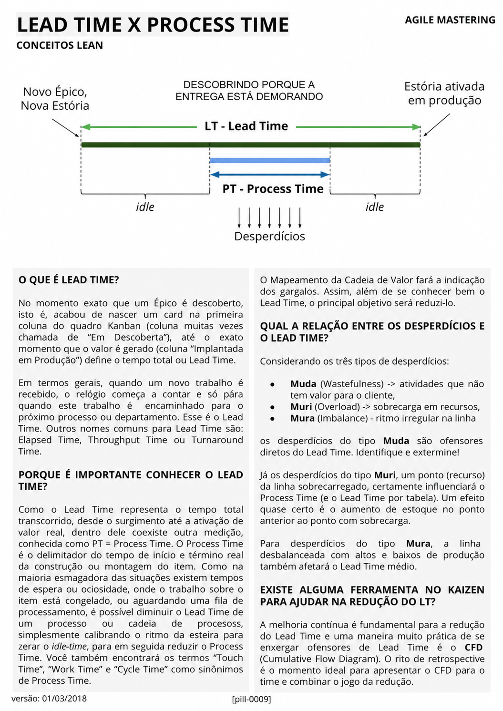

# Lead Time x Process Time

<figure class="agile-pill-facsimile">
  
  <figcaption>Composição visual original da pill 0009.</figcaption>
</figure>

## Transcrição textual

## O que é Lead Time?

No momento exato que um Épico é descoberto, isto é, acabou de nascer um card na primeira coluna do quadro
Kanban (coluna muitas vezes chamada de “Em Descoberta”), até o exato momento que o valor é gerado (coluna
“Implantada em Produção”) define o tempo total ou Lead Time.

Em termos gerais, quando um novo trabalho é recebido, o relógio começa a contar e só pára quando este trabalho
é encaminhado para o próximo processo ou departamento. Esse é o Lead Time. Outros nomes comuns para Lead Time
são: Elapsed Time, Throughput Time ou Turnaround Time.

## Porque é importante conhecer o Lead Time?

Como o Lead Time representa o tempo total transcorrido, desde o surgimento até a ativação de valor real,
dentro dele coexiste outra medição, conhecida como PT = Process Time. O Process Time é o delimitador do tempo
de início e término real da construção ou montagem do item. Como na maioria esmagadora das situações existem
tempos de espera ou ociosidade, onde o trabalho sobre o item está congelado, ou aguardando uma fila de
processamento, é possível diminuir o Lead Time de um processo ou cadeia de processos, simplesmente calibrando
o ritmo da esteira para zerar o idle-time, para em seguida reduzir o Process Time. Você também encontrará os
termos “Touch Time”, “Work Time” e “Cycle Time” como sinônimos de Process Time.

O Mapeamento da Cadeia de Valor fará a indicação dos gargalos. Assim, além de se conhecer bem o Lead Time, o
principal objetivo será reduzi-lo.

## Qual a relação entre os desperdícios e o Lead Time?

Considerando os três tipos de desperdícios:

- Muda (Wastefulness): atividades que não tem valor para o cliente;
- Muri (Overload): sobrecarga em recursos;
- Mura (Imbalance): ritmo irregular na linha.

Os desperdícios do tipo Muda são ofensores diretos do Lead Time. Identifique e extermine!

Já os desperdícios do tipo Muri, um ponto (recurso) da linha sobrecarregado, certamente influenciará o Process
Time (e o Lead Time por tabela). Um efeito quase certo é o aumento de estoque no ponto anterior ao ponto com
sobrecarga.

Para desperdícios do tipo Mura, a linha desbalanceada com altos e baixos de produção também afetará o Lead
Time médio.

## Existe alguma ferramenta no Kaizen para ajudar na redução do LT?

A melhoria contínua é fundamental para a redução do Lead Time e uma maneira muito prática de se enxergar
ofensores de Lead Time é o CFD (Cumulative Flow Diagram). O rito de retrospective é o momento ideal para
apresentar o CFD para o time e combinar o jogo da redução.

## Anotações editoriais

- Lead time depende dos pontos de início e fim definidos para a medição; não começa necessariamente no
  nascimento de um épico.
- Cycle time e process/touch time não são sinônimos universais. A política de medição deve definir os termos
  explicitamente antes de compará-los.
- Conteúdo relacionado: [Lead Time, Cycle Time, WIP, Aging e Throughput]({{ site.baseurl }}/Métricas-&-Indicadores-(KPI)/Lead-Time,-Cycle-Time,-WIP,-Aging-e-Throughput.html).

**Proveniência:** `[pill-0009]`, versão de 01/03/2018. Anotações adicionadas em 2026.
