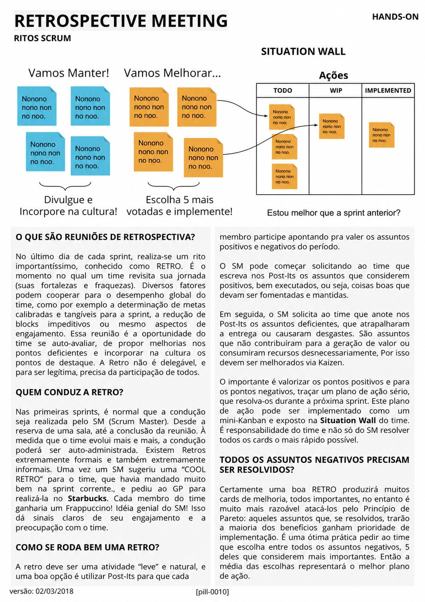

# Retrospective Meeting

<figure class="agile-pill-facsimile">
  
  <figcaption>Composição visual original da pill 0010.</figcaption>
</figure>

## Transcrição textual

## O que são reuniões de retrospectiva?

No último dia de cada sprint, realiza-se um rito importantíssimo, conhecido como RETRO. É o momento no qual
um time revisita sua jornada (suas fortalezas e fraquezas). Diversos fatores podem cooperar para o desempenho
global do time, como por exemplo a determinação de metas calibradas e tangíveis para a sprint, a redução de
blocks impeditivos ou mesmo aspectos de engajamento. Essa reunião é a oportunidade do time se auto-avaliar,
de propor melhorias nos pontos deficientes e incorporar na cultura os pontos de destaque. A Retro não é
delegável, e para ser legítma, precisa da participação de todos.

## Quem conduz a Retro?

Nas primeiras sprints, é normal que a condução seja realizada pelo SM (Scrum Master). Desde a reserva de uma
sala, até a conclusão da reunião. À medida que o time evolui mais e mais, a condução poderá ser
auto-administrada. Existem Retros extremamente formais e também extremamente informais. Uma vez um SM sugeriu
uma “COOL RETRO” para o time, que havia mandado muito bem na sprint corrente, e pediu ao GP para realizá-la no
Starbucks. Cada membro do time ganharia um Frappuccino! Idéia genial do SM! Isso dá sinais claros de seu
engajamento e a preocupação com o time.

## Como se roda bem uma Retro?

A retro deve ser uma atividade “leve” e natural, e uma boa opção é utilizar Post-Its para que cada membro
participe apontando pra valer os assuntos positivos e negativos do período.

O SM pode começar solicitando ao time que escreva nos Post-Its os assuntos que considerem positivos, bem
executados, ou seja, coisas boas que devam ser fomentadas e mantidas.

Em seguida, o SM solicita ao time que anote nos Post-Its os assuntos deficientes, que atrapalharam a entrega
ou causaram desgastes. São assuntos que não contribuíram para a geração de valor ou consumiram recursos
desnecessariamente, Por isso devem ser melhorados via Kaizen.

O importante é valorizar os pontos positivos e para os pontos negativos, traçar um plano de ação sério, que
resolva-os durante a próxima sprint. Este plano de ação pode ser implementado como um mini-Kanban e exposto na
Situation Wall do time.

É responsabilidade do time e não só do SM resolver todos os cards o mais rápido possível.

## Todos os assuntos negativos precisam ser resolvidos?

Certamente uma boa RETRO produzirá muitos cards de melhoria, todos importantes, no entanto é muito mais
razoável atacá-los pelo Princípio de Pareto: aqueles assuntos que, se resolvidos, trarão a maioria dos
benefícios ganham prioridade de implementação. É uma ótima prática pedir ao time que escolha entre todos os
assuntos negativos, 5 deles que considerem mais importantes. Então a média das escolhas representará o melhor
plano de ação.

## Anotações editoriais

- O Scrum Guide 2020 chama o evento de **Sprint Retrospective**. Seu propósito é planejar maneiras de aumentar
  qualidade e eficácia.
- O evento ocorre após a Sprint Review e conclui a Sprint, mas não precisa ser literalmente no mesmo dia em
  todo contexto.
- Post-its, Pareto, votação e quadro de ações são técnicas possíveis, não regras. É preferível assumir poucas
  melhorias relevantes e acompanhar seus efeitos.

**Proveniência:** `[pill-0010]`, versão de 02/03/2018. Anotações adicionadas em 2026.
