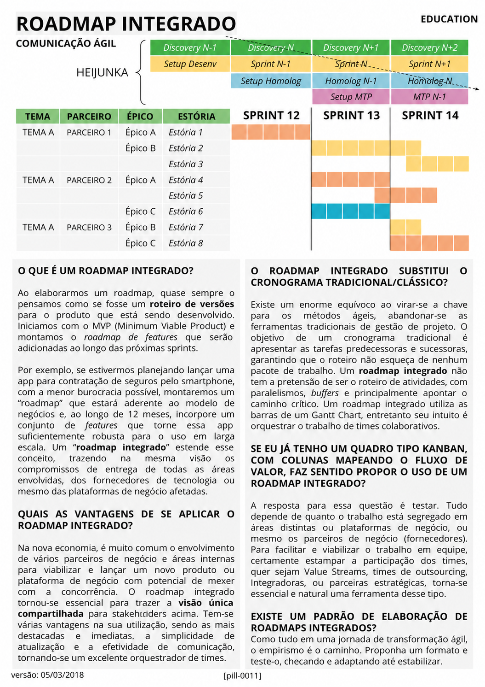

# Roadmap Integrado

<figure class="agile-pill-facsimile">
  
  <figcaption>Composição visual original da pill 0011.</figcaption>
</figure>

## Transcrição textual

## O que é um Roadmap Integrado?

Ao elaborarmos um roadmap, quase sempre o pensamos como se fosse um roteiro de versões para o produto que
está sendo desenvolvido. Iniciamos com o MVP (Minimum Viable Product) e montamos o roadmap de features que
serão adicionadas ao longo das próximas sprints.

Por exemplo, se estivermos planejando lançar uma app para contratação de seguros pelo smartphone, com a
menor burocracia possível, montaremos um “roadmap” que estará aderente ao modelo de negócios e, ao longo de
12 meses, incorpore um conjunto de features que torne essa app suficientemente robusta para o uso em larga
escala. Um “roadmap integrado” estende esse conceito, trazendo na mesma visão os compromissos de entrega de
todas as áreas envolvidas, dos fornecedores de tecnologia ou mesmo das plataformas de negócio afetadas.

## Quais as vantagens de se aplicar o Roadmap Integrado?

Na nova economia, é muito comum o envolvimento de vários parceiros de negócio e áreas internas para viabilizar
e lançar um novo produto ou plataforma de negócio com potencial de mexer com a concorrência. O roadmap
integrado tornou-se essencial para trazer a visão única compartilhada para stakeholders acima. Tem-se várias
vantagens na sua utilização, sendo as mais destacadas e imediatas, a simplicidade de atualização e a
efetividade de comunicação, tornando-se um excelente orquestrador de times.

## O Roadmap Integrado substitui o cronograma tradicional/clássico?

Existe um enorme equívoco ao virar-se a chave para os métodos ágeis, abandonar-se as ferramentas tradicionais
de gestão de projeto. O objetivo de um cronograma tradicional é apresentar as tarefas predecessoras e
sucessoras, garantindo que o roteiro não esqueça de nenhum pacote de trabalho. Um roadmap integrado não tem a
pretensão de ser o roteiro de atividades, com paralelismos, buffers e principalmente apontar o caminho
crítico. Um roadmap integrado utiliza as barras de um Gantt Chart, entretanto seu intuito é orquestrar o
trabalho de times colaborativos.

## Se eu já tenho um quadro tipo Kanban, faz sentido propor um Roadmap Integrado?

A resposta para essa questão é testar. Tudo depende de quanto o trabalho está segregado em áreas distintas ou
plataformas de negócio, ou mesmo os parceiros de negócio (fornecedores). Para facilitar e viabilizar o
trabalho em equipe, certamente estampar a participação dos times, quer sejam Value Streams, times de
outsourcing, Integradoras, ou parceiras estratégicas, torna-se essencial e natural uma ferramenta desse tipo.

## Existe um padrão de elaboração de Roadmaps Integrados?

Como tudo em uma jornada de transformação ágil, o empirismo é o caminho. Proponha um formato e teste-o,
checando e adaptando até estabilizar.

## Anotações editoriais

- Roadmaps comunicam direção e hipóteses; tratá-los como compromissos fixos de features pode reduzir a
  capacidade de adaptação.
- Roadmap, cronograma e quadro de fluxo respondem a perguntas diferentes e podem coexistir quando há uma
  necessidade explícita para cada um.

**Proveniência:** `[pill-0011]`, versão de 05/03/2018. Anotações adicionadas em 2026.
