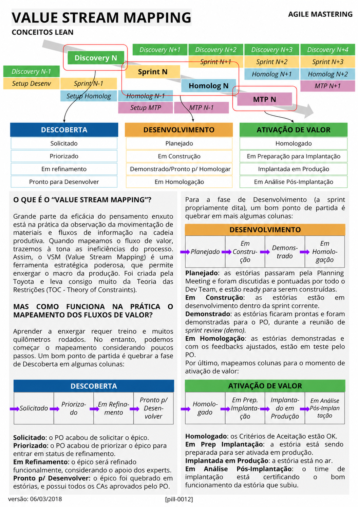

# Value Stream Mapping

<figure class="agile-pill-facsimile">
  
  <figcaption>Composição visual original da pill 0012.</figcaption>
</figure>

## Transcrição textual

## O que é o “Value Stream Mapping”?

Grande parte da eficácia do pensamento enxuto está na prática da observação da movimentação de materiais e
fluxos de informação na cadeia produtiva. Quando mapeamos o fluxo de valor, trazemos à tona as ineficiências do
processo. Assim, o VSM (Value Stream Mapping) é uma ferramenta estratégica poderosa, que permite enxergar o
macro da produção. Foi criada pela Toyota e leva consigo muito da Teoria das Restrições (TOC - Theory of
Constraints).

## Mas como funciona na prática o mapeamento dos fluxos de valor?

Aprender a enxergar requer treino e muitos quilômetros rodados. No entanto, podemos começar o mapeamento
considerando poucos passos. Um bom ponto de partida é quebrar a fase de Descoberta em algumas colunas:

- **Solicitado:** o PO acabou de solicitar o épico.
- **Priorizado:** o PO acabou de priorizar o épico para entrar em status de refinamento.
- **Em Refinamento:** o épico será refinado funcionalmente, considerando o apoio dos experts.
- **Pronto p/ Desenvolver:** o épico foi quebrado em estórias, e possui todos os CAs aprovados pelo PO.

Para a fase de Desenvolvimento (a sprint propriamente dita), um bom ponto de partida é quebrar em mais algumas
colunas:

- **Planejado:** as estórias passaram pela Planning Meeting e foram discutidas e pontuadas por todo o Dev
  Team, e estão ready para serem construídas.
- **Em Construção:** as estórias estão em desenvolvimento dentro da sprint corrente.
- **Demonstrado:** as estórias ficaram prontas e foram demonstradas para o PO, durante a reunião de sprint
  review (demo).
- **Em Homologação:** as estórias demonstradas e com os feedbacks ajustados, estão em teste pelo PO.

Por último, mapeamos colunas para o momento de ativação de valor:

- **Homologado:** os Critérios de Aceitação estão OK.
- **Em Prep Implantação:** a estória está sendo preparada para ser ativada em produção.
- **Implantada em Produção:** a estória está no ar.
- **Em Análise Pós-Implantação:** o time de implantação está certificando o bom funcionamento da estória que
  subiu.

## Anotações editoriais

- O fluxo proposto é um exemplo contextual, não um modelo universal de VSM.
- Sprint Review não é apenas uma demo para o Product Owner, e homologação pelo PO não é uma etapa prescrita
  pelo Scrum.
- VSM deve representar o fluxo real, seus tempos, informações e desperdícios, e orientar experimentos entre
  o estado atual e um estado futuro.
- Conteúdo relacionado: [Gestão do Fluxo de Valor]({{ site.baseurl }}/Conceitos-Ágeis/Gestão-do-Fluxo-de-Valor.html).

**Proveniência:** `[pill-0012]`, versão de 06/03/2018. Anotações adicionadas em 2026.
