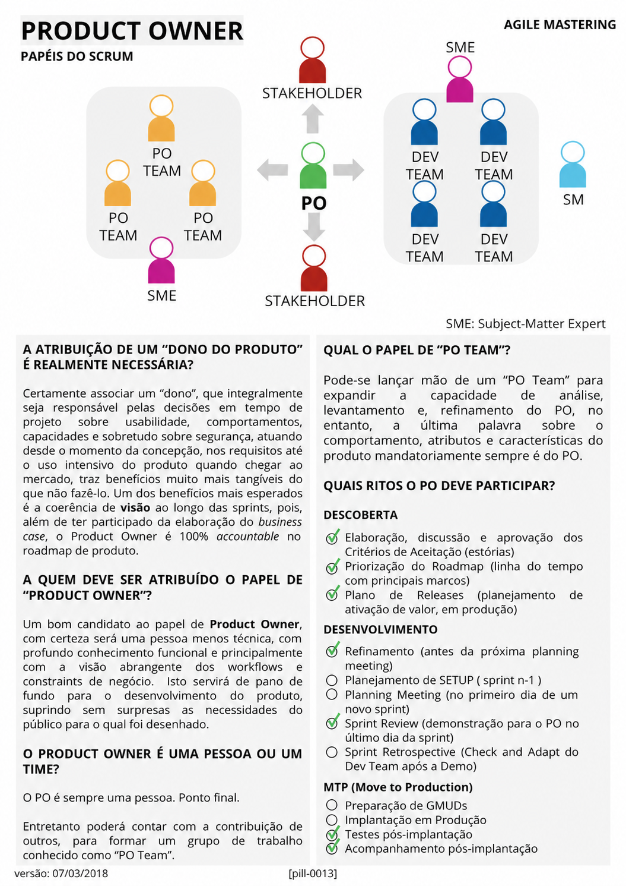

# Product Owner

<figure class="agile-pill-facsimile">
  
  <figcaption>Composição visual original da pill 0013.</figcaption>
</figure>

## Transcrição textual

## A atribuição de um “dono do produto” é realmente necessária?

Certamente associar um “dono”, que integralmente seja responsável pelas decisões em tempo de projeto sobre
usabilidade, comportamentos, capacidades e sobretudo sobre segurança, atuando desde o momento da concepção,
nos requisitos até o uso intensivo do produto quando chegar ao mercado, traz benefícios muito mais tangíveis
do que não fazê-lo. Um dos benefícios mais esperados é a coerência de visão ao longo das sprints, pois, além
de ter participado da elaboração do business case, o Product Owner é 100% accountable no roadmap de produto.

## A quem deve ser atribuído o papel de “Product Owner”?

Um bom candidato ao papel de Product Owner, com certeza será uma pessoa menos técnica, com profundo
conhecimento funcional e principalmente com a visão abrangente dos workflows e constraints de negócio. Isto
servirá de pano de fundo para o desenvolvimento do produto, suprindo sem surpresas as necessidades do público
para o qual foi desenhado.

## O Product Owner é uma pessoa ou um time?

O PO é sempre uma pessoa. Ponto final.

Entretanto poderá contar com a contribuição de outros, para formar um grupo de trabalho conhecido como “PO
Team”.

## Qual o papel de “PO Team”?

Pode-se lançar mão de um “PO Team” para expandir a capacidade de análise, levantamento e, refinamento do PO,
no entanto, a última palavra sobre o comportamento, atributos e características do produto mandatoriamente
sempre é do PO.

## Quais ritos o PO deve participar?

### Descoberta

- Elaboração, discussão e aprovação dos Critérios de Aceitação (estórias)
- Priorização do Roadmap (linha do tempo com principais marcos)
- Plano de Releases (planejamento de ativação de valor, em produção)
- Refinamento (antes da próxima planning meeting)
- Planejamento de SETUP (sprint n-1)

### Desenvolvimento

- Planning Meeting (no primeiro dia de um novo sprint)
- Sprint Review (demonstração para o PO no último dia da sprint)
- Sprint Retrospective (Check and Adapt do Dev Team após a Demo)

### MTP (Move to Production)

- Preparação de GMUDs
- Implantação em Produção
- Testes pós-implantação
- Acompanhamento pós-implantação

## Anotações editoriais

- O Scrum Guide define o Product Owner como accountable por maximizar o valor do produto e pela gestão
  efetiva do Product Backlog; não como proprietário de todas as decisões técnicas, de segurança ou operação.
- Conhecimento técnico não desqualifica um Product Owner. A competência necessária depende do produto e do
  contexto.
- “PO Team”, Discovery, Setup e MTP não são elementos definidos pelo Scrum Guide.
- Conteúdo relacionado: [Product Owner]({{ site.baseurl }}/Conceitos-Ágeis/Papeis-e-Responsabilidades/Product-Owner.html).

**Proveniência:** `[pill-0013]`, versão de 07/03/2018. Anotações adicionadas em 2026.
