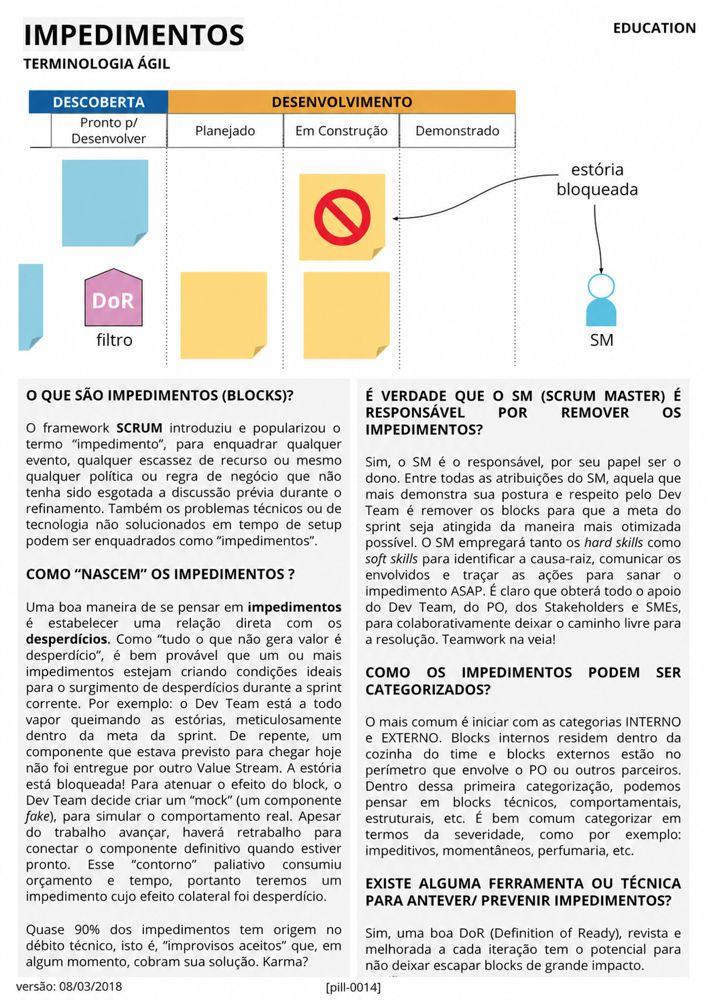

# Impedimentos

<figure class="agile-pill-facsimile">
  
  <figcaption>Composição visual original da pill 0014.</figcaption>
</figure>

## Transcrição textual

## O que são impedimentos (blocks)?

O framework SCRUM introduziu e popularizou o termo “impedimento”, para enquadrar qualquer evento, qualquer
escassez de recurso ou mesmo qualquer política ou regra de negócio que não tenha sido esgotada a discussão
prévia durante o refinamento. Também os problemas técnicos ou de tecnologia não solucionados em tempo de
setup podem ser enquadrados como “impedimentos”.

## Como “nascem” os impedimentos?

Uma boa maneira de se pensar em impedimentos é estabelecer uma relação direta com os desperdícios. Como
“tudo o que não gera valor é desperdício”, é bem provável que um ou mais impedimentos estejam criando
condições ideais para o surgimento de desperdícios durante a sprint corrente. Por exemplo: o Dev Team está a
todo vapor queimando as estórias, meticulosamente dentro da meta da sprint. De repente, um componente que
estava previsto para chegar hoje não foi entregue por outro Value Stream. A estória está bloqueada! Para
atenuar o efeito do block, o Dev Team decide criar um “mock” (um componente fake), para simular o comportamento
real. Apesar do trabalho avançar, haverá retrabalho para conectar o componente definitivo quando estiver
pronto. Esse “contorno” paliativo consumiu orçamento e tempo, portanto teremos um impedimento cujo efeito
colateral foi desperdício.

Quase 90% dos impedimentos tem origem no débito técnico, isto é, “improvisos aceitos” que, em algum momento,
cobram sua solução. Karma?

## É verdade que o SM é responsável por remover os impedimentos?

Sim, o SM é o responsável, por seu papel ser o dono. Entre todas as atribuições do SM, aquela que mais
demonstra sua postura e respeito pelo Dev Team é remover os blocks para que a meta do sprint seja atingida da
maneira mais otimizada possível. O SM empregará tanto os hard skills como soft skills para identificar a
causa-raiz, comunicar os envolvidos e traçar as ações para sanar o impedimento ASAP. É claro que obterá todo
o apoia do Dev Team, do PO, dos Stakeholders e SMEs, para colaborativamente deixar o caminho livre para a
resolução. Teamwork na veia!

## Como os impedimentos podem ser categorizados?

O mais comum é iniciar com as categorias INTERNO e EXTERNO. Blocks internos residem dentro da cozinha do time
e blocks externos estão no perímetro que envolve o PO ou outros parceiros. Dentro dessa primeira
categorização, podemos pensar em blocks técnicos, comportamentais, estruturais, etc. É bem comum categorizar
em termos da severidade, como por exemplo: impeditivos, momentâneos, perfumaria, etc.

## Existe alguma ferramenta ou técnica para antever/prevenir impedimentos?

Sim, uma boa DoR (Definition of Ready), revista e melhorada a cada iteração tem o potencial para não deixar
escapar blocks de grande impacto.

## Anotações editoriais

- A afirmação de que “quase 90%” dos impedimentos vêm de débito técnico não apresenta evidência no material
  original e não deve ser generalizada.
- O Scrum Master causa a remoção de impedimentos ao progresso do Scrum Team, mas não é o único responsável
  por resolver pessoalmente cada bloqueio.
- Definition of Ready pode ajudar como política local, mas não elimina incerteza nem é parte do Scrum Guide.
- Conteúdo relacionado: [O que são Impedimentos?]({{ site.baseurl }}/Conceitos-Ágeis/Scrum/O-que-são-Impedimentos%3F.html).

**Proveniência:** `[pill-0014]`, versão de 08/03/2018. Anotações adicionadas em 2026.
