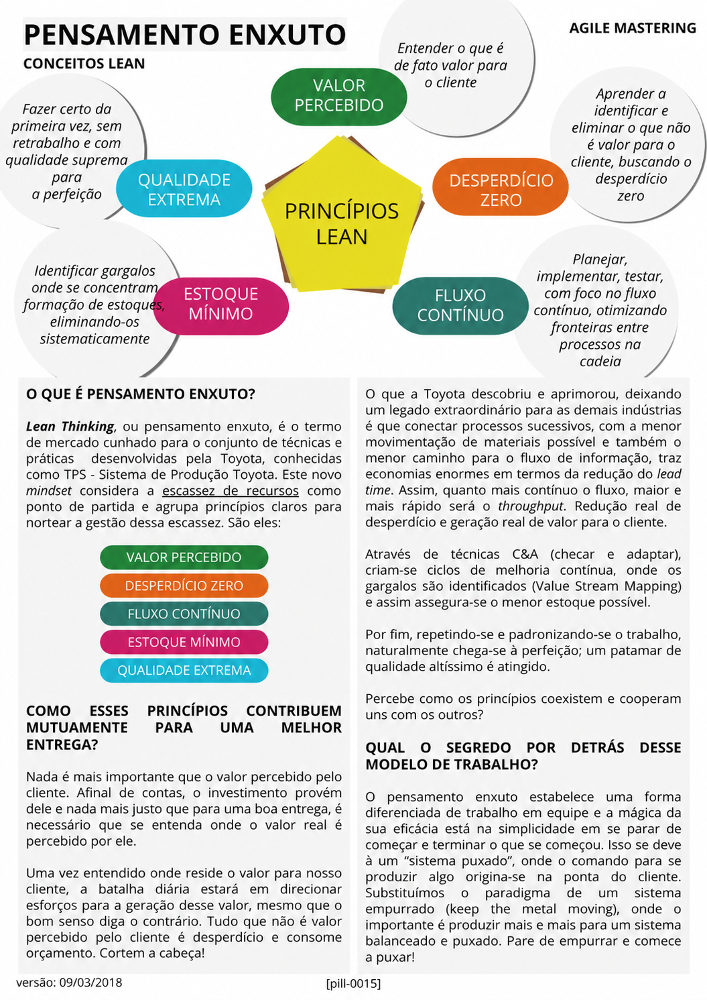

# Pensamento Enxuto

<figure class="agile-pill-facsimile">
  
  <figcaption>Composição visual original da pill 0015.</figcaption>
</figure>

## Transcrição textual

## O que é Pensamento Enxuto?

Lean Thinking, ou pensamento enxuto, é o termo de mercado cunhado para o conjunto de técnicas e práticas
desenvolvidas pela Toyota, conhecidas como TPS - Sistema de Produção Toyota. Este novo mindset considera a
escassez de recursos como ponto de partida e agrupa princípios claros para nortear a gestão dessa escassez.
São eles:

- Valor percebido
- Desperdício zero
- Fluxo contínuo
- Estoque mínimo
- Qualidade extrema

## Como esses princípios contribuem mutuamente para uma melhor entrega?

Nada é mais importante que o valor percebido pelo cliente. Afinal de contas, o investimento provém dele e
nada mais justo que para uma boa entrega, é necessário que se entenda onde o valor real é percebido por ele.

Uma vez entendido onde reside o valor para nosso cliente, a batalha diária estará em direcionar esforços para
a geração desse valor, mesmo que o bom senso diga o contrário. Tudo que não é valor percebido pelo cliente é
desperdício e consome orçamento. Cortem a cabeça!

O que a Toyota descobriu e aprimorou, deixando um legado extraordinário para as demais indústrias é que
conectar processos sucessivos, com a menor movimentação de materiais possível e também o menor caminho para o
fluxo de informação, traz economias enormes em termos da redução do lead time. Assim, quanto mais contínuo o
fluxo, maior e mais rápido será o throughput. Redução real de desperdício e geração real de valor para o
cliente.

Através de técnicas C&A (checar e adaptar), criam-se ciclos de melhoria contínua, onde os gargalos são
identificados (Value Stream Mapping) e assim assegura-se o menor estoque possível.

Por fim, repetindo-se e padronizando-se o trabalho, naturalmente chega-se à perfeição; um patamar de qualidade
altíssimo é atingido.

Percebe como os princípios coexistem e cooperam uns com os outros?

## Qual o segredo por detrás desse modelo de trabalho?

O pensamento enxuto estabelece uma forma diferenciada de trabalho em equipe e a mágica da sua eficácia está
na simplicidade em se parar de começar e terminar o que se começou. Isso se deve à um “sistema puxado”, onde o
comando para se produzir algo origina-se na ponta do cliente.

Substituímos o paradigma de um sistema empurrado (keep the metal moving), onde o importante é produzir mais e
mais para um sistema balanceado e puxado. Pare de empurrar e comece a puxar!

## Anotações editoriais

- A formulação clássica de Womack e Jones apresenta cinco princípios: valor, fluxo de valor, fluxo, puxar e
  perfeição. A lista da pill é uma interpretação prática desses princípios.
- Perfeição em Lean é uma busca contínua, não um estado naturalmente garantido apenas por repetição e
  padronização.
- Conteúdo relacionado: [Lean Thinking]({{ site.baseurl }}/Conceitos-Ágeis/Lean/Lean-Thinking.html).
- Referência: [Lean Thinking and Practice](https://www.lean.org/lexicon-terms/lean-thinking-and-practice/).

**Proveniência:** `[pill-0015]`, versão de 09/03/2018. Anotações adicionadas em 2026.
