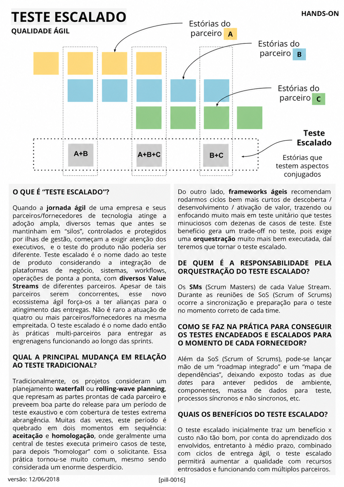

# Teste Escalado

<figure class="agile-pill-facsimile">
  
  <figcaption>Composição visual original da pill 0016.</figcaption>
</figure>

## Transcrição textual

## O que é “Teste Escalado”?

Quando a jornada ágil de uma empresa e seus parceiros/fornecedores de tecnologia atinge a adoção ampla,
diversos temas que antes se mantinham em “silos”, controlados e protegidos por ilhas de gestão, começam a
exigir atenção dos executivos, e o teste do produto não poderia ser diferente. Teste escalado é o nome dado ao
teste de produto considerando a integração de plataformas de negócio, sistemas, workflows, operações de
ponta a ponta, com diversos Value Streams de diferentes parceiros. Apesar de tais parceiros serem
concorrentes, esse novo ecossistema ágil força-os a ter alianças para o atingimento das entregas. Não é raro a
atuação de quatro ou mais parceiros/fornecedores na mesma empreitada. O teste escalado é o nome dado então às
práticas multi-parceiros para entregar as engrenagens funcionando ao longo das sprints.

## Qual a principal mudança em relação ao teste tradicional?

Tradicionalmente, os projetos consideram um planejamento waterfall ou rolling-wave planning, que represam as
partes prontas de cada parceiro e preveem boa parte do release para um período de teste exaustivo e com
cobertura de testes extrema abrangência. Muitas das vezes, este período é quebrado em dois momentos em
sequência: aceitação e homologação, onde geralmente uma central de testes executa primeiro casos de teste,
para depois “homologar” com o solicitante. Essa prática tornou-se muito comum, mesmo sendo considerada um
enorme desperdício.

Do outro lado, frameworks ágeis recomendam rodarmos ciclos bem mais curtos de descoberta / desenvolvimento /
ativação de valor, trazendo ou enfocando muito mais em teste unitário que testes minuciosos com dezenas de
casos de teste. Este benefício gera um trade-off no teste, pois exige uma orquestração muito mais bem
executada, daí teremos que tornar o teste escalado.

## De quem é a responsabilidade pela orquestração do Teste Escalado?

Os SMs (Scrum Masters) de cada Value Stream. Durante as reuniões de SoS (Scrum of Scrums) ocorre a
sincronização e preparação para o teste no momento correto de cada time.

## Como se faz na prática para conseguir os testes encadeados e escalados?

Além da SoS (Scrum of Scrums), pode-se lançar mão de um “roadmap integrado” e um “mapa de dependências”,
deixando exposto todas as due dates para antever pedidos de ambiente, componentes, massa de dados para teste,
processos síncronos e não síncronos, etc.

## Quais os benefícios do Teste Escalado?

O teste escalado inicialmente traz um benefício x custo não tão bom, por conta do aprendizado dos envolvidos,
entretanto à médio prazo, combinado com ciclos de entrega ágil, o teste escalado permitirá aumentar a
qualidade com recursos entrosados e funcionando com múltiplos parceiros.

## Anotações editoriais

- “Teste escalado” e Scrum of Scrums são práticas contextuais, não elementos prescritos pelo Scrum Guide.
- A responsabilidade por qualidade é compartilhada. A orquestração não pertence automaticamente aos Scrum
  Masters; precisa ser definida conforme arquitetura, risco, produto e estrutura organizacional.
- Ciclos curtos não substituem testes de integração, segurança, desempenho ou ponta a ponta quando o risco os
  exige.

**Proveniência:** `[pill-0016]`, versão de 12/06/2018. Anotações adicionadas em 2026.
