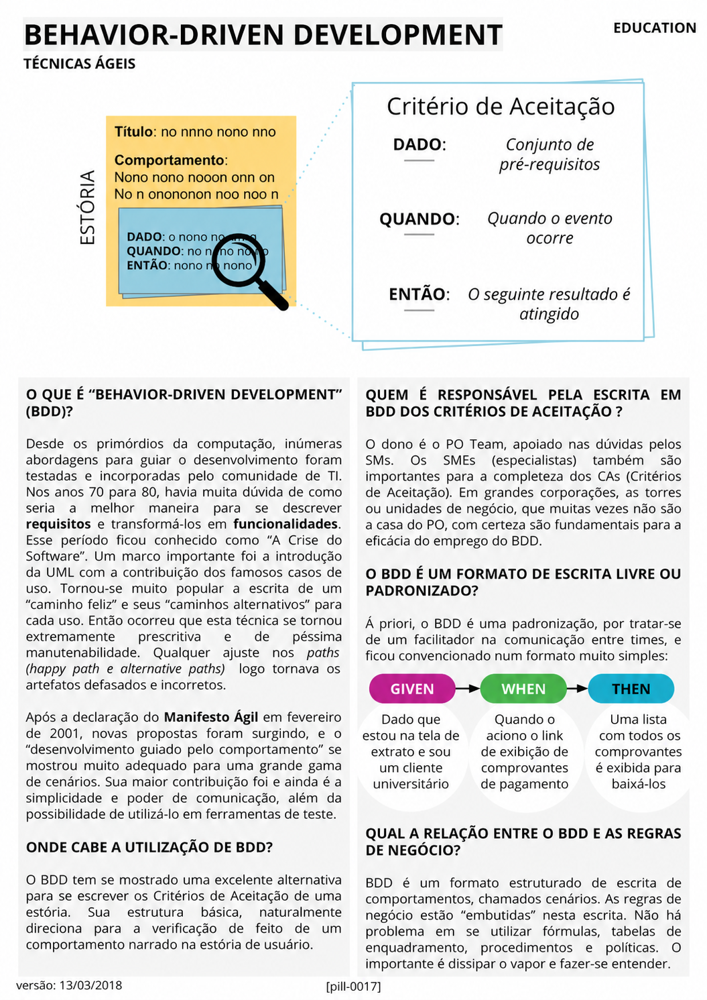

# Behavior-Driven Development

<figure class="agile-pill-facsimile">
  
  <figcaption>Composição visual original da pill 0017.</figcaption>
</figure>

## Transcrição textual

## O que é “Behavior-Driven Development” (BDD)?

Desde os primórdios da computação, inúmeras abordagens para guiar o desenvolvimento foram testadas e
incorporadas pelo comunidade de TI. Nos anos 70 para 80, havia muita dúvida de como seria a melhor maneira
para se descrever requisitos e transformá-los em funcionalidades. Esse período ficou conhecido como “A Crise
do Software”. Um marco importante foi a introdução da UML com a contribuição dos famosos casos de uso.
Tornou-se muito popular a escrita de um “caminho feliz” e seus “caminhos alternativos” para cada uso. Então
ocorreu que esta técnica se tornou extremamente prescritiva e de péssima manutenabilidade. Qualquer ajuste nos
paths (happy path e alternative paths) logo tornava os artefatos defasados e incorretos.

Após a declaração do Manifesto Ágil em fevereiro de 2001, novas propostas foram surgindo, e o
“desenvolvimento guiado pelo comportamento” se mostrou muito adequado para uma grande gama de cenários. Sua
maior contribuição foi e ainda é a simplicidade e poder de comunicação, além da possibilidade de utilizá-lo
em ferramentas de teste.

## Onde cabe a utilização de BDD?

O BDD tem se mostrado uma excelente alternativa para se escrever os Critérios de Aceitação de uma estória.
Sua estrutura básica, naturalmente direciona para a verificação de feito de um comportamento narrado na
estória de usuário.

## Quem é responsável pela escrita em BDD dos critérios de aceitação?

O dono é o PO Team, apoiado nas dúvidas pelos SMs. Os SMEs (especialistas) também são importantes para a
completeza dos CAs (Critérios de Aceitação). Em grandes corporações, as torres ou unidades de negócio, que
muitas vezes não são a casa do PO, com certeza são fundamentais para a eficácia do emprego do BDD.

## O BDD é um formato de escrita livre ou padronizado?

Á priori, o BDD é uma padronização, por tratar-se de um facilitador na comunicação entre times, e ficou
convencionado num formato muito simples:

- **DADO:** conjunto de pré-requisitos;
- **QUANDO:** quando o evento ocorre;
- **ENTÃO:** o seguinte resultado é atingido.

## Qual a relação entre o BDD e as regras de negócio?

BDD é um formato estruturado de escrita de comportamentos, chamados cenários. As regras de negócio estão
“embutidas” nesta escrita. Não há problema em se utilizar fórmulas, tabelas de enquadramento, procedimentos e
políticas. O importante é dissipar o vapor e fazer-se entender.

## Anotações editoriais

- BDD não nasceu diretamente do Manifesto Ágil nem se resume ao formato Given/When/Then. Seu núcleo é a
  colaboração por exemplos para descobrir e comunicar comportamento.
- A escrita não pertence a um “PO Team”. Produto, negócio, desenvolvimento e testes colaboram para construir
  entendimento compartilhado.
- Conteúdo relacionado: [BDD]({{ site.baseurl }}/Conceitos-Ágeis/BDD.html).

**Proveniência:** `[pill-0017]`, versão de 13/03/2018. Anotações adicionadas em 2026.
