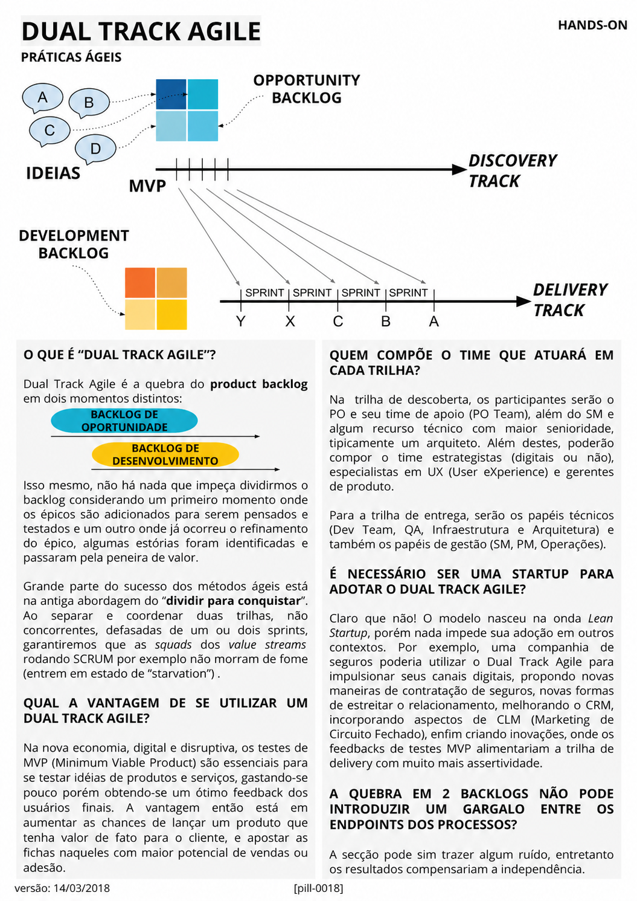

# Dual Track Agile

<figure class="agile-pill-facsimile">
  
  <figcaption>Composição visual original da pill 0018.</figcaption>
</figure>

## Transcrição textual

## O que é “Dual Track Agile”?

Dual Track Agile é a quebra do product backlog em dois momentos distintos.

Isso mesmo, não há nada que impeça dividirmos o backlog considerando um primeiro momento onde os épicos são
adicionados para serem pensados e testados e um outro onde já ocorreu o refinamento do épico, algumas
estórias foram identificadas e passaram pela peneira de valor.

Grande parte do sucesso dos métodos ágeis está na antiga abordagem do “dividir para conquistar”. Ao separar e
coordenar duas trilhas, não concorrentes, defasadas de um ou dois sprints, garantiremos que as squads dos
value streams rodando SCRUM por exemplo não morram de fome (entrem em estado de “starvation”).

## Qual a vantagem de se utilizar um Dual Track Agile?

Na nova economia, digital e disruptiva, os testes de MVP (Minimum Viable Product) são essenciais para se
testar idéias de produtos e serviços, gastando-se pouco porém obtendo-se um ótimo feedback dos usuários
finais. A vantagem então está em aumentar as chances de lançar um produto que tenha valor de fato para o
cliente, e apostar as fichas naqueles com maior potencial de vendas ou adesão.

## Quem compõe o time que atuará em cada trilha?

Na trilha de descoberta, os participantes serão o PO e seu time de apoio (PO Team), além do SM e algum recurso
técnico com maior senioridade, tipicamente um arquiteto. Além destes, poderão compor o time estrategistas
(digitais ou não), especialistas em UX (User eXperience) e gerentes de produto.

Para a trilha de entrega, serão os papéis técnicos (Dev Team, QA, Infraestrutura e Arquitetura) e também os
papéis de gestão (SM, PM, Operações).

## É necessário ser uma startup para adotar o Dual Track Agile?

Claro que não! O modelo nasceu na onda Lean Startup, porém nada impede sua adoção em outros contextos. Por
exemplo, uma companhia de seguros poderia utilizar o Dual Track Agile para impulsionar seus canais digitais,
propondo novas maneiras de contratação de seguros, novas formas de estreitar o relacionamento, melhorando o
CRM, incorporando aspectos de CLM (Marketing de Circuito Fechado), enfim criando inovações, onde os feedbacks
de testes MVP alimentariam a trilha de delivery com muito mais assertividade.

## A quebra em 2 backlogs não pode introduzir um gargalo entre os endpoints dos processos?

A secção pode sim trazer algum ruído, entretanto os resultados compensariam a independência.

## Anotações editoriais

- Dual Track não exige dois backlogs, times separados nem uma defasagem fixa de uma ou duas Sprints.
- Discovery e Delivery funcionam melhor como atividades contínuas, colaborativas e conectadas por feedback,
  sem passagem rígida entre departamentos.
- Conteúdo relacionado: [Dual-track Scrum]({{ site.baseurl }}/Conceitos-Ágeis/Dual%2Dtrack-Scrum.html).

**Proveniência:** `[pill-0018]`, versão de 14/03/2018. Anotações adicionadas em 2026.
