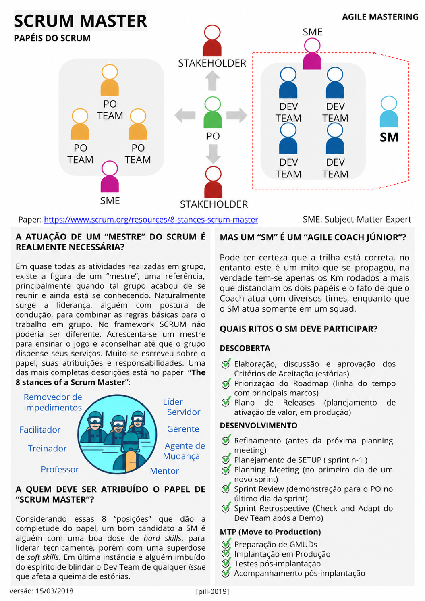

# Scrum Master

<figure class="agile-pill-facsimile">
  
  <figcaption>Composição visual original da pill 0019.</figcaption>
</figure>

## Transcrição textual

## A atuação de um “mestre” do Scrum é realmente necessária?

Em quase todas as atividades realizadas em grupo, existe a figura de um “mestre”, uma referência,
principalmente quando tal grupo acabou de se reunir e ainda está se conhecendo. Naturalmente surge a
liderança, alguém com postura de condução, para combinar as regras básicas para o trabalho em grupo. No
framework SCRUM não poderia ser diferente. Acrescenta-se um mestre para ensinar o jogo e aconselhar até que o
grupo dispense seus serviços. Muito se escreveu sobre o papel, suas atribuições e responsabilidades. Uma das
mais completas descrições está no paper “The 8 stances of a Scrum Master”.

## A quem deve ser atribuído o papel de “Scrum Master”?

Considerando essas 8 “posições” que dão a completude do papel, um bom candidato a SM é alguém com uma boa
dose de hard skills, para liderar tecnicamente, porém com uma superdose de soft skills. Em última instância é
alguém imbuído do espírito de blindar o Dev Team de qualquer issue que afeta a queima de estórias.

## Mas um “SM” é um “Agile Coach Júnior”?

Pode ter certeza que a trilha está correta, no entanto este é um mito que se propagou, na verdade tem-se
apenas os Km rodados a mais que distanciam os dois papéis e o fato de que o Coach atua com diversos times,
enquanto que o SM atua somente em um squad.

## Quais ritos o SM deve participar?

### Descoberta

- Elaboração, discussão e aprovação dos Critérios de Aceitação (estórias)
- Priorização do Roadmap (linha do tempo com principais marcos)
- Plano de Releases (planejamento de ativação de valor, em produção)
- Refinamento (antes da próxima planning meeting)
- Planejamento de SETUP (sprint n-1)

### Desenvolvimento

- Planning Meeting (no primeiro dia de um novo sprint)
- Sprint Review (demonstração para o PO no último dia da sprint)
- Sprint Retrospective (Check and Adapt do Dev Team após a Demo)

### MTP (Move to Production)

- Preparação de GMUDs
- Implantação em Produção
- Testes pós-implantação
- Acompanhamento pós-implantação

Referência original: [The 8 Stances of a Scrum Master](https://www.scrum.org/resources/8-stances-scrum-master).

## Anotações editoriais

- O Scrum Master é accountable por estabelecer Scrum e pela efetividade do Scrum Team; não é necessariamente
  líder técnico nem proteção contra toda interação externa.
- Scrum Master e Agile Coach não formam uma progressão universal de carreira, e o Scrum Guide não limita o
  Scrum Master a um único time.
- Discovery, Setup e MTP não são ritos definidos pelo Scrum Guide.
- Conteúdo relacionado: [Scrum Master]({{ site.baseurl }}/Conceitos-Ágeis/Papeis-e-Responsabilidades/Scrum-Master.html).

**Proveniência:** `[pill-0019]`, versão de 15/03/2018. Anotações adicionadas em 2026.
