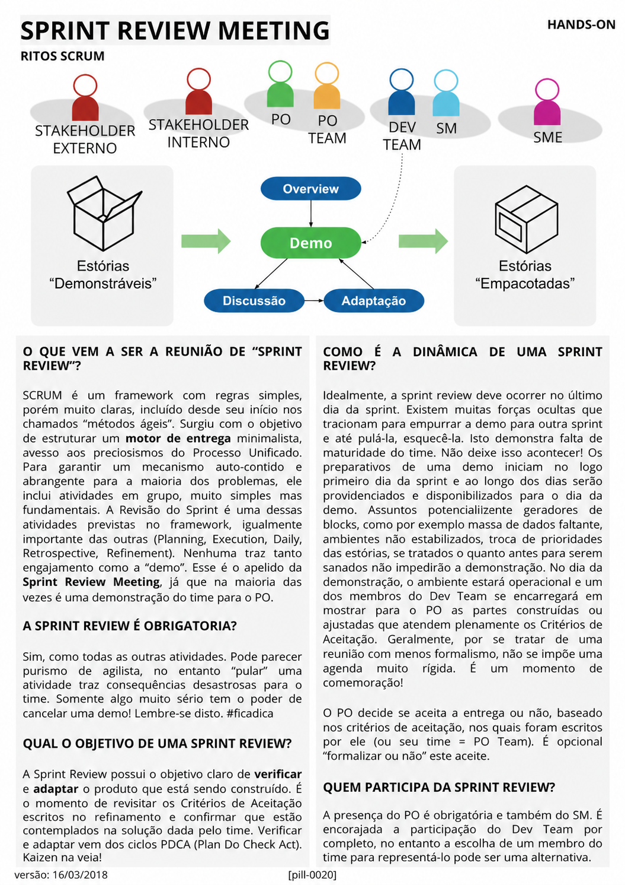

# Sprint Review Meeting

<figure class="agile-pill-facsimile">
  
  <figcaption>Composição visual original da pill 0020.</figcaption>
</figure>

## Transcrição textual

## O que vem a ser a reunião de “Sprint Review”?

SCRUM é um framework com regras simples, porém muito claras, incluído desde seu início nos chamados “métodos
ágeis”. Surgiu com o objetivo de estruturar um motor de entrega minimalista, avesso aos preciosismos do
Processo Unificado. Para garantir um mecanismo auto-contido e abrangente para a maioria dos problemas, ele
inclui atividades em grupo, muito simples mas fundamentais. A Revisão do Sprint é uma dessas atividades
previstas no framework, igualmente importante das outras (Planning, Execution, Daily, Retrospective,
Refinement). Nenhuma traz tanto engajamento como a “demo”. Esse é o apelido da Sprint Review Meeting, já que
na maioria das vezes é uma demonstração do time para o PO.

## A Sprint Review é obrigatória?

Sim, como todas as outras atividades. Pode parecer purismo de agilista, no entanto “pular” uma atividade traz
consequências desastrosas para o time. Somente algo muito sério tem o poder de cancelar uma demo! Lembre-se
disto. #ficadica

## Qual o objetivo de uma Sprint Review?

A Sprint Review possui o objetivo claro de verificar e adaptar o produto que está sendo construído. É o
momento de revisitar os Critérios de Aceitação escritos no refinamento e confirmar que estão contemplados na
solução dada pelo time. Verificar e adaptar vem dos ciclos PDCA (Plan Do Check Act). Kaizen na veia!

## Como é a dinâmica de uma Sprint Review?

Idealmente, a sprint review deve ocorrer no último dia da sprint. Existem muitas forças ocultas que tracionam
para empurrar a demo para outra sprint e até pulá-la, esquecê-la. Isto demonstra falta de maturidade do time.
Não deixe isso acontecer! Os preparativos de uma demo iniciam no logo primeiro dia da sprint e ao longo dos
dias serão providenciados e disponibilizados para o dia da demo. Assuntos potencialmente geradores de blocks,
como por exemplo massa de dados faltante, ambientes não estabilizados, troca de prioridades das estórias, se
tratados o quanto antes para serem sanados não impedirão a demonstração. No dia da demonstração, o ambiente
estará operacional e um dos membros do Dev Team se encarregará em mostrar para o PO as partes construídas ou
ajustadas que atendem plenamente os Critérios de Aceitação. Geralmente, por se tratar de uma reunião com menos
formalismo, não se impõe uma agenda muito rígida. É um momento de comemoração!

O PO decide se aceita a entrega ou não, baseado nos critérios de aceitação, nos quais foram escritos por ele
(ou seu time = PO Team). É opcional “formalizar ou não” este aceite.

## Quem participa da Sprint Review?

A presença do PO é obrigatória e também do SM. É encorajada a participação do Dev Team por completo, no
entanto a escolha de um membro do time para representá-lo pode ser uma alternativa.

## Anotações editoriais

- A Sprint Review é uma sessão de trabalho para inspecionar o resultado da Sprint e determinar adaptações
  futuras; não é apenas uma demo ou aceite formal pelo Product Owner.
- Todo o Scrum Team e stakeholders relevantes participam. Substituir os Developers por um representante
  reduz a capacidade de colaboração e não corresponde à definição atual do evento.
- “Execution” e “Refinement” não são eventos do Scrum. O timebox máximo da Review é de quatro horas para uma
  Sprint de um mês.

**Proveniência:** `[pill-0020]`, versão de 16/03/2018. Anotações adicionadas em 2026.
