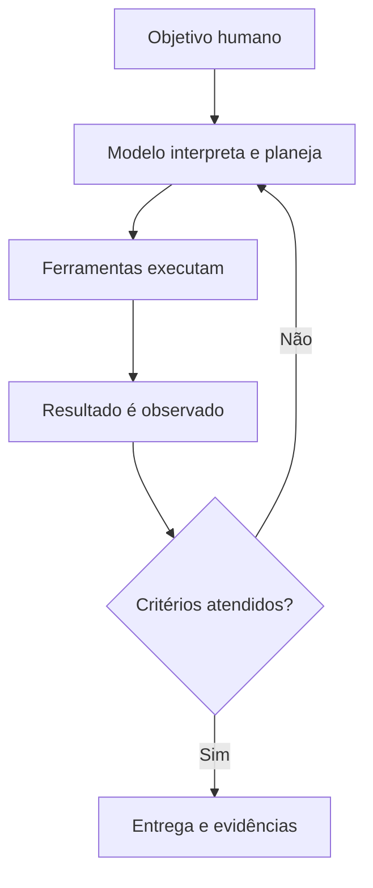

# Cognificação: da IA aos Sistemas Agênticos

> O avanço da inteligência artificial não acontece apenas dentro do modelo. Ele emerge da combinação entre modelos, contexto, ferramentas, infraestrutura, feedback e responsabilidade humana.

## O que é cognificação

**Cognificar** significa incorporar alguma forma de inteligência a produtos, serviços, processos e ambientes. O termo foi popularizado por Kevin Kelly no livro *Inevitável: as 12 forças tecnológicas que mudarão o nosso mundo*, publicado originalmente em 2016.

A proposta de Kelly não era prever um único sistema artificial com inteligência humana completa. Sua visão era mais distribuída: diferentes formas de inteligência seriam acrescentadas a objetos, profissões, organizações e atividades cotidianas, assim como a eletricidade foi incorporada a praticamente toda a infraestrutura moderna.

Sob essa perspectiva, a inteligência artificial deixa de ser apenas um produto separado e passa a funcionar como uma capacidade presente em outras coisas:

- sistemas que interpretam informações e recomendam ações;
- aplicações que aprendem com dados e feedback;
- ferramentas que colaboram com pessoas;
- processos que ganham capacidade de análise, adaptação ou execução;
- produtos que incorporam percepção, linguagem ou decisão automatizada.

Cognificar não significa tornar tudo consciente. Significa acrescentar capacidades cognitivas específicas onde elas produzam utilidade.

## A previsão de Kevin Kelly

Ao escrever na metade da década de 2010, Kelly identificou três condições que impulsionavam a inteligência artificial:

1. computação paralela mais acessível;
2. grande disponibilidade de dados;
3. algoritmos de aprendizado mais eficientes.

O desenvolvimento posterior da IA confirmou a relevância dessas condições, mas também acrescentou outros elementos: modelos fundacionais, aprendizado por reforço, interfaces em linguagem natural, recuperação de conhecimento, uso de ferramentas, memória, infraestrutura de nuvem e sistemas agênticos.

Outro aspecto importante da visão de Kelly é que a IA tenderia a ser:

- **distribuída**, em vez de confinada a uma única máquina;
- **especializada**, com diferentes inteligências adequadas a diferentes problemas;
- **conectada**, aprendendo e operando por meio de redes;
- **incorporada**, tornando-se progressivamente menos visível como tecnologia separada;
- **complementar**, criando combinações entre capacidades humanas e sintéticas.

Essa perspectiva ajuda a compreender a IA contemporânea: o valor não está somente em conversar com um modelo, mas em cognificar o trabalho, conectando inteligência a processos reais.

## Do modelo isolado ao sistema agêntico

Um modelo de linguagem recebe contexto e produz uma continuação provável. Por si só, ele não conhece automaticamente a situação atual de uma organização, não possui acesso irrestrito aos sistemas e não verifica cada afirmação que produz.

Um **sistema agêntico** acrescenta uma arquitetura ao redor do modelo. Essa arquitetura pode permitir que o sistema:

- interprete um objetivo;
- decomponha o trabalho em etapas;
- selecione e utilize ferramentas;
- consulte fontes externas;
- preserve estado e memória;
- execute ações;
- observe os resultados;
- corrija tentativas;
- solicite aprovação humana;
- registre evidências e decisões.

A repetição entre planejamento, execução e observação é uma das principais diferenças entre uma resposta isolada e um fluxo agêntico.

## O que é o *agent harness*

O termo ***agent harness*** descreve o ambiente de execução construído ao redor do modelo. Ele organiza como o agente recebe contexto, utiliza ferramentas, controla o fluxo, trata erros e verifica resultados.

Considere um agente de programação. O modelo pode gerar uma alteração incorreta na primeira tentativa. O *harness* pode:

1. aplicar a mudança em um ambiente delimitado;
2. executar testes e verificações;
3. capturar a mensagem de erro;
4. devolver essa evidência ao modelo;
5. solicitar uma correção;
6. repetir o ciclo dentro de limites definidos.

O modelo não se torna infalível. O sistema melhora o resultado porque transforma erros observáveis em novo contexto e cria oportunidades de correção.

Um *harness* pode incluir:

| Componente | Função |
|---|---|
| Contexto | Apresentar objetivo, regras, documentos e estado atual |
| Ferramentas | Permitir consulta, execução e interação com sistemas |
| Orquestração | Controlar etapas, transições, tentativas e interrupções |
| Memória e estado | Preservar informações relevantes durante o trabalho |
| Avaliações | Verificar critérios, qualidade e segurança |
| Permissões | Limitar dados, comandos e ações disponíveis |
| Observabilidade | Registrar decisões, custos, erros e resultados |
| Aprovação humana | Interromper o fluxo antes de ações sensíveis |

Por isso, comparar soluções apenas pelo modelo utilizado oferece uma visão incompleta. A qualidade também depende da engenharia do sistema em que o modelo está inserido.

## Contexto, ferramentas e feedback

Três elementos ajudam a explicar por que sistemas agênticos podem superar o uso isolado de um modelo.

### Contexto

O agente precisa conhecer o problema, os limites, as fontes confiáveis e os critérios de aceitação. Mais contexto não é automaticamente melhor: informações excessivas, antigas ou conflitantes podem prejudicar o resultado.

A engenharia de contexto busca selecionar a informação necessária para cada etapa do trabalho, mantendo origem, prioridade e atualidade.

### Ferramentas

Ferramentas permitem que o agente produza efeitos fora da geração de texto. Ele pode pesquisar documentos, consultar bancos de dados, executar testes, ler um repositório ou interagir com um sistema autorizado.

A capacidade de chamar ferramentas não concede autoridade ilimitada. Cada integração deve definir permissões, escopo, validações e ações que exigem confirmação.

### Feedback

O resultado de uma ação pode ser transformado em nova evidência. Um teste que falhou, uma consulta sem resultados ou uma validação rejeitada ajudam o sistema a ajustar sua próxima tentativa.

Esse ciclo não garante acerto. Ele reduz a dependência de uma única geração e torna parte do processo verificável.

## Modelos maiores não são a única direção

Durante parte da evolução recente da IA, aumentar dados, parâmetros e capacidade computacional foi uma estratégia central. Essa expansão continua relevante, mas enfrenta custos econômicos e físicos crescentes.

Ao mesmo tempo, a indústria passou a investir em outras formas de melhorar utilidade e eficiência:

- modelos especializados para diferentes classes de tarefa;
- arquiteturas *Mixture of Experts*;
- raciocínio com maior computação durante a inferência;
- uso estruturado de ferramentas;
- recuperação de informações;
- compactação e gerenciamento de contexto;
- *prompt caching*;
- modelos menores para tarefas delimitadas;
- avaliações e ciclos de correção;
- melhor orquestração entre modelos, ferramentas e pessoas.

Em uma arquitetura *Mixture of Experts*, apenas uma parte dos parâmetros pode ser ativada para cada token. Isso não significa que os especialistas correspondam necessariamente a divisões humanas simples, como um idioma ou uma profissão. A especialização é aprendida durante o treinamento e sua organização interna pode não ser diretamente interpretável.

Também não existe evidência suficiente para afirmar que os modelos de linguagem chegaram definitivamente ao seu limite. Há debate sobre retornos marginais, disponibilidade de dados, custo energético, novas arquiteturas e a possibilidade de outras abordagens. O cenário mais prudente é reconhecer que a evolução não depende de uma única curva de crescimento.

## A “era discada” da inteligência artificial

Comparar o momento atual da IA com a internet discada é uma metáfora útil, desde que seus limites sejam reconhecidos.

No início da internet comercial, a utilidade da rede já era perceptível, mas a experiência ainda era marcada por:

- conexões lentas;
- quedas frequentes;
- infraestrutura insuficiente;
- custos e limites de utilização;
- padrões ainda em formação;
- grande diferença entre promessa e experiência cotidiana.

A IA contemporânea apresenta tensões semelhantes: limitação de capacidade, variação de desempenho, latência, custo de inferência, dependência de fornecedores e práticas de engenharia ainda em consolidação.

A analogia não prova que a IA seguirá exatamente a trajetória da internet. Ela ajuda a interpretar uma tecnologia cuja utilidade já existe, embora infraestrutura, governança e modelos de operação ainda estejam amadurecendo.

## Infraestrutura também define inteligência disponível

A inteligência oferecida por um sistema não depende apenas de algoritmos. Ela depende de chips, memória, redes, data centers, energia, refrigeração e capacidade de atender solicitações em escala.

A Agência Internacional de Energia projeta forte crescimento no consumo elétrico dos data centers ao longo desta década, impulsionado em parte por cargas de trabalho de IA. Essa pressão cria desafios relacionados a:

- expansão da geração e transmissão de energia;
- eficiência de hardware e software;
- localização dos data centers;
- disponibilidade de água e refrigeração;
- emissões associadas à matriz energética;
- concentração de infraestrutura em poucas organizações;
- competição por capacidade computacional.

É importante distinguir o consumo de todos os data centers do consumo específico de IA. Números agregados não devem ser apresentados automaticamente como se fossem causados apenas por modelos generativos.

A evolução da IA será, portanto, simultaneamente algorítmica, arquitetural, econômica e energética.

## Cognificar não é automatizar indiscriminadamente

Adicionar inteligência a um processo não significa entregar todas as decisões a um agente.

Quanto maior a capacidade de ação, maior deve ser a clareza sobre:

- propósito;
- autoridade;
- dados permitidos;
- critérios de decisão;
- impacto de uma falha;
- necessidade de supervisão;
- rastreabilidade;
- possibilidade de pausa e reversão.

Processos instáveis, ambíguos ou sensíveis não se tornam maduros apenas porque receberam uma camada de IA. Em muitos casos, o primeiro benefício da cognificação é tornar explícitos conhecimentos, regras e critérios que antes estavam dispersos.

## O papel humano se transforma

A combinação entre pessoas e inteligências sintéticas não elimina automaticamente o trabalho humano. Ela desloca parte de seu valor.

Ganham importância atividades como:

- formular bons problemas;
- estabelecer propósito e prioridades;
- selecionar fontes confiáveis;
- explicitar critérios de aceitação;
- desenhar limites e permissões;
- avaliar evidências;
- lidar com ambiguidades;
- assumir responsabilidade pelas decisões;
- compreender consequências humanas e organizacionais.

A máquina pode ampliar capacidade de análise e execução. Pessoas continuam responsáveis por decidir quais objetivos merecem ser perseguidos, quais riscos são aceitáveis e como os impactos serão distribuídos.

## Evidências, interpretações e questões em aberto

### Sustentado por evidências técnicas

- sistemas agênticos combinam modelos, ferramentas, contexto e controle de fluxo;
- ciclos de execução e feedback podem melhorar resultados verificáveis;
- infraestrutura, energia e capacidade computacional condicionam a escala;
- técnicas de eficiência são tão importantes quanto simplesmente ampliar modelos;
- permissões, avaliações e supervisão são necessárias em ações de maior impacto.

### Interpretações úteis, mas não leis

- estamos vivendo uma “era discada” da IA;
- o ativo mais valioso tende a migrar do modelo isolado para o sistema completo;
- a cognificação pode tornar a IA progressivamente invisível no trabalho cotidiano;
- parte da produção de software tende a se tornar mais acessível e abundante.

### Questões ainda abertas

- quais limites as arquiteturas atuais encontrarão;
- se sistemas baseados em modelos de linguagem poderão alcançar inteligência mais geral;
- como custos de energia e infraestrutura afetarão a concentração do mercado;
- quais funções profissionais serão transformadas, reduzidas ou criadas;
- como medir produtividade sem confundir volume produzido com valor entregue.

## Síntese

Kevin Kelly descreveu a cognificação como uma força de transformação: acrescentar inteligência às coisas que já fazem parte do mundo.

A IA agêntica torna essa visão mais concreta. O modelo deixa de ser apenas uma interface de resposta e passa a compor sistemas que consultam, executam, observam e corrigem.

O movimento central não é apenas criar uma máquina cada vez maior. É aprender a organizar inteligências diferentes dentro de sistemas confiáveis, conectados a processos reais e governados por propósitos humanos.

Cognificar o trabalho exige tecnologia. Civilizar essa tecnologia exige discernimento, responsabilidade e aprendizado contínuo.

## Páginas relacionadas

- [Tokens e Tokenização em LLMs](./Tokens-e-Tokenizacao-em-LLMs.md)
- [Engenharia de Software com GenAI e IA Agêntica](./Engenharia-de-Software-com-GenAI-e-IA-Agentica.md)
- [IA Operacional — Framework CHIA](./IA-Operacional-Framework-CHIA.md)
- [Engenharia de Grafos](./Engenharia-de-Grafos.md)
- [Profissões e Papéis](./Profissões-e-Papéis.md)

## Fontes

- KELLY, Kevin. *Inevitável: as 12 forças tecnológicas que mudarão o nosso mundo*. Capítulo 2: “Cognificar”. Publicação original em inglês, 2016.
- Anthropic. **Building effective agents**, 19 dez. 2024: https://www.anthropic.com/engineering/building-effective-agents
- Anthropic. **Effective context engineering for AI agents**, 29 set. 2025: https://www.anthropic.com/engineering/effective-context-engineering-for-ai-agents
- OpenAI. **A practical guide to building AI agents**: https://openai.com/business/guides-and-resources/a-practical-guide-to-building-ai-agents/
- OpenAI. **Harness engineering: leveraging Codex in an agent-first world**, 11 fev. 2026: https://openai.com/index/harness-engineering/
- DeepSeek-AI. **DeepSeek-V3 Technical Report**: https://arxiv.org/abs/2412.19437
- International Energy Agency. **Energy and AI**: https://www.iea.org/reports/energy-and-ai

## Proveniência e confiança

A ideia inicial desta página surgiu de uma conversa técnica em formato de vídeo/transcrição sobre modelos, agentes, infraestrutura e a comparação entre a IA atual e a internet discada. Como a transcrição não identificava de forma confiável todos os participantes, dados e afirmações foram tratados como insumo, não como fonte factual independente.

A interpretação histórica foi construída a partir do capítulo “Cognificar”, de Kevin Kelly. Conceitos de agentes, contexto, ferramentas e *harness engineering* foram confrontados com materiais técnicos da Anthropic e da OpenAI. A explicação sobre *Mixture of Experts* foi validada com o relatório técnico do DeepSeek-V3. As considerações energéticas foram delimitadas com base na Agência Internacional de Energia.

Foram removidos rumores empresariais, ataques pessoais, linguagem depreciativa, comparações ambientais sem metodologia, números não sustentados e previsões categóricas sobre o fim da evolução dos modelos.

**Confiança alta:** definição operacional de sistemas agênticos, função de contexto, ferramentas, feedback, infraestrutura, avaliações e supervisão.

**Confiança moderada:** cognificação como lente para interpretar a evolução atual e a metáfora da “era discada da IA”.

**Confiança baixa ou questão em aberto:** afirmações categóricas sobre teto das LLMs, surgimento de inteligência geral, fim do valor do software ou trajetória econômica definitiva do setor.

Data da última revisão: 2026-09-17
