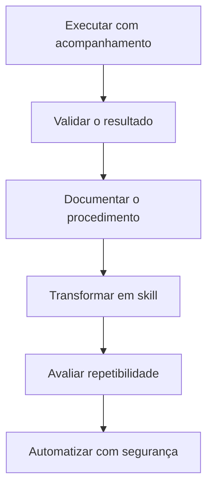

# IA Operacional — Framework CHIA

## O que é IA operacional

**IA operacional** é uma forma de integrar agentes de inteligência artificial ao trabalho cotidiano como uma camada de execução e apoio sobre documentos, processos, ferramentas e fontes oficiais. Em vez de usar a IA apenas como um chat isolado, o agente recebe contexto organizado, procedimentos reutilizáveis, integrações controladas e, quando o processo está maduro, automações.

O diferencial não depende apenas do modelo utilizado. Ele resulta da combinação entre:

- capacidade do modelo;
- qualidade e atualidade do contexto;
- clareza dos processos e critérios;
- ferramentas disponíveis;
- permissões e controles;
- validação dos resultados.

O ativo durável, portanto, não é um modelo isolado, mas o **sistema de conhecimento e operação construído
ao redor dele**.

## Origem e enquadramento do CHIA

O acrônimo **CHIA** foi apresentado didaticamente pelo canal Ratos de IA no vídeo
[*“Transformei o Claude Code no sistema operacional da minha empresa (e mostrei como criar o teu)”*](https://www.youtube.com/watch?v=7btZsF-9UDA),
publicado em 2026.

CHIA organiza quatro dimensões de um ambiente de trabalho apoiado por agentes:

| Pilar                   | O que significa                                                |
| ----------------------- | -------------------------------------------------------------- |
| **C**ontexto      | Pastas, arquivos, instruções, fontes e histórico organizado |
| **H**abilidades   | Procedimentos repetíveis transformados em*skills*           |
| **I**ntegrações | Acesso controlado a sistemas, APIs, conectores e ferramentas   |
| **A**utomações  | Rotinas executadas periodicamente ou disparadas por eventos    |

Neste conteúdo, CHIA é tratado como um **modelo didático de organização**, não como norma técnica, metodologia acadêmica ou framework universalmente consolidado. Seu valor está em tornar visíveis os componentes necessários para transformar o uso pontual de IA em uma capacidade operacional.

## Os quatro pilares

### Contexto

Contexto é o conjunto de informações disponibilizadas ao agente para interpretar a tarefa e agir com coerência. Pode incluir instruções, documentação, decisões, exemplos, estado do trabalho e fontes canônicas.

Organizar arquivos ajuda, mas contexto não se resume a pastas. Empresas e projetos também dependem de bancos de dados, sistemas transacionais, permissões, registros de auditoria, responsáveis formais e políticas de retenção.

Mais contexto também não significa necessariamente melhor contexto. Informação excessiva, desatualizada ou sem prioridade aumenta ruído e pode reduzir a qualidade da resposta. O objetivo da engenharia de contexto é selecionar a informação mínima, suficiente e confiável para cada execução.

### Habilidades

Habilidades, ou *skills*, são procedimentos reutilizáveis que orientam o agente sobre como executar uma atividade conhecida. Elas podem registrar:

- objetivo e condições de uso;
- entradas necessárias;
- sequência de trabalho;
- ferramentas permitidas;
- critérios de qualidade;
- tratamento de falhas;
- resultado esperado.

Uma *skill* não elimina julgamento humano nem transforma automaticamente um processo em automação. Ela reduz redescoberta, melhora consistência e torna o conhecimento operacional versionável.

### Integrações

Integrações permitem ao agente consultar ou operar sistemas externos por conectores, APIs, MCPs, interfaces de linha de comando ou outras ferramentas.

Cada integração deve explicitar:

- fonte oficial consultada;
- permissões mínimas necessárias;
- ações de leitura e escrita disponíveis;
- dados que podem ser acessados;
- necessidade de aprovação humana;
- registro e rastreabilidade das operações.

A existência de uma integração não significa que o agente deva receber acesso irrestrito ao sistema.

### Automações

Automações executam rotinas sem que cada etapa seja iniciada manualmente. Podem funcionar por agenda, evento ou condição monitorada.

Automação é o último estágio, não o primeiro. Antes dela, o processo precisa ser compreendido, executado com supervisão, corrigido, documentado e testado. Automatizar um processo instável apenas faz seus erros acontecerem com mais velocidade e escala.

## Da prática acompanhada à automação

Sinais de que uma atividade pode virar *skill*:

- já foi ensinada e executada mais de uma vez;
- as mesmas correções aparecem repetidamente;
- entradas e saídas estão razoavelmente definidas;
- existem critérios para verificar a qualidade;
- os limites de atuação são conhecidos.

Sinais de que ainda não deve ser automatizada:

- depende de decisões subjetivas ou sensíveis sem critério explícito;
- as fontes mudam frequentemente e não há validação;
- falhas podem produzir impacto externo relevante;
- não existe responsável pelo resultado;
- o processo ainda muda a cada execução.

## Benefícios possíveis

Quando bem estruturada, uma camada de IA operacional pode:

- reduzir o tempo gasto procurando informações;
- preservar decisões e conhecimento operacional;
- transformar práticas recorrentes em procedimentos reutilizáveis;
- conectar fontes sem substituir seus papéis oficiais;
- apoiar síntese, planejamento e execução assistida;
- reduzir retrabalho e perda de contexto;
- facilitar a melhoria contínua dos processos.

Esses benefícios não são automáticos. Dependem da qualidade da implementação, do acompanhamento humano e da adequação do caso de uso.

## Governança e limites

Os sistemas corporativos, repositórios e documentos aprovados continuam sendo as **fontes oficiais da
verdade**. A IA atua como camada de recuperação, síntese, padronização, conexão e execução assistida; não
deve se tornar uma fonte da verdade independente.

Uma implementação responsável precisa considerar:

- **confidencialidade:** impedir exposição indevida de dados pessoais, estratégicos ou contratuais;
- **permissões mínimas:** limitar cada agente às ferramentas necessárias;
- **aprovação humana:** preservar decisões humanas em ações sensíveis ou irreversíveis;
- **rastreabilidade:** registrar fontes, mudanças, ferramentas utilizadas e resultados;
- **atualização:** revisar contexto, instruções e *skills* quando o processo mudar;
- **avaliação:** testar precisão, consistência e comportamento em casos esperados e adversos;
- **recuperação:** prever interrupção, correção e reversão quando houver falha.

## Limitações e críticas

### “A empresa vira pastas e arquivos”

Pastas e arquivos são uma boa interface de contexto para agentes, mas não representam toda a operação.
Processos reais também dependem de sistemas transacionais, bancos de dados, identidades, aprovações,
auditoria e responsabilidades organizacionais.

### “Contexto vale mais que o modelo”

É uma provocação útil, não uma lei absoluta. Contexto e processo frequentemente produzem mais ganho do
que simplesmente trocar para o modelo mais recente, mas a capacidade do modelo continua sendo decisiva
em tarefas que exigem raciocínio, percepção, uso de ferramentas ou confiabilidade específicos.

### “Sistema operacional”

A expressão comunica integração e centralidade, mas pode sugerir que a IA substitui os sistemas da
organização. Um enquadramento mais preciso é **camada inteligente de trabalho** sobre sistemas,
documentos e processos existentes.

## Perguntas para aplicação

1. Qual informação importante ainda fica perdida em conversas ou na memória das pessoas?
2. Qual atividade repetitiva já pode ser documentada como procedimento?
3. Quais fontes precisam ser conectadas para recuperar contexto com segurança?
4. Que permissões e aprovações cada integração exige?
5. O que já está estável o suficiente para ser automatizado?
6. Como o resultado será validado, auditado e corrigido?

## Páginas relacionadas

- [Engenharia de Grafos](./Engenharia-de-Grafos.md)
- Engenharia de Contexto — expansão futura
- Agent Skills — expansão futura
- Sistemas Multiagentes — expansão futura
- Observabilidade e Avaliação de Agentes — expansão futura

## Fontes

- Ratos de IA. **“Transformei o Claude Code no sistema operacional da minha empresa (e mostrei como criar o teu)”**. YouTube, 2026: https://www.youtube.com/watch?v=7btZsF-9UDA
- Anthropic. **“Effective context engineering for AI agents”**, 29 set. 2025: https://www.anthropic.com/engineering/effective-context-engineering-for-ai-agents
- Anthropic. **“Building Effective AI Agents”**, 19 dez. 2024: https://www.anthropic.com/engineering/building-effective-agents
- Anthropic. **“Writing effective tools for agents — with agents”**, 11 set. 2025: https://www.anthropic.com/engineering/writing-tools-for-agents
- OpenAI. **“A practical guide to building agents”**: https://openai.com/business/guides-and-resources/a-practical-guide-to-building-ai-agents/

## Proveniência e confiança

O framework CHIA, os quatro pilares e a metáfora de sistema operacional vêm do vídeo do canal Ratos de
IA. As explicações sobre contexto, ferramentas, simplicidade, controles e construção de agentes foram
confrontadas com materiais técnicos da Anthropic e da OpenAI.

**Confiança alta:** importância de contexto selecionado, ferramentas bem definidas, permissões,
avaliação e supervisão humana.

**Confiança moderada:** CHIA como nomenclatura durável. O acrônimo é útil como síntese didática, mas ainda
não representa uma disciplina ou padrão amplamente estabelecido.
