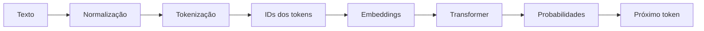

# Tokens e Tokenização em LLMs

> Antes de gerar linguagem, um modelo precisa transformar texto em unidades discretas que possam ser representadas e processadas numericamente.

## O que é um token

Um **token** é uma unidade discreta pertencente ao vocabulário de um modelo. Ele funciona como uma peça intermediária entre o texto compreendido por pessoas e as representações numéricas processadas pela rede neural.

Um token não corresponde necessariamente a uma palavra inteira. Dependendo do tokenizador, pode representar:

- uma palavra;
- parte de uma palavra;
- um caractere;
- uma sequência de bytes;
- pontuação;
- um espaço associado ao texto seguinte;
- um emoji ou parte dele;
- um marcador especial usado pelo sistema.

Por isso, contar palavras não é uma forma confiável de calcular tokens. A mesma frase pode produzir contagens diferentes conforme o modelo, o tokenizador, o idioma e a estrutura da mensagem enviada.

## Por que modelos precisam de tokens

Pessoas interagem por meio de linguagem, mas modelos computacionais operam sobre números. A tokenização cria uma ponte entre essas duas representações.

O processo, de forma simplificada, segue este fluxo:

Cada token recebe um identificador numérico. Esse identificador é usado para localizar um **embedding**, isto é, um vetor que representa aquele token em um espaço matemático aprendido pelo modelo.

O Transformer processa esses vetores levando em consideração as relações entre as unidades do contexto. Ao final, produz uma distribuição de probabilidades sobre os tokens que poderiam aparecer em seguida.

O modelo não manipula palavras da mesma forma que uma pessoa e também não executa apenas uma substituição de texto por números. Ele combina álgebra linear, mecanismos de atenção, normalizações, funções não lineares e regras de geração para calcular o próximo token.

## Por que não usar apenas palavras ou caracteres

Existem três estratégias intuitivas para dividir um texto.

| Estratégia | Vantagem | Limitação |
|---|---|---|
| Palavras inteiras | Sequências menores e leitura intuitiva | Vocabulário enorme; dificuldade com flexões, erros e palavras novas |
| Caracteres ou bytes | Vocabulário pequeno e cobertura ampla | Sequências mais longas e maior custo de processamento |
| Subpalavras | Equilíbrio entre cobertura e comprimento | A segmentação pode variar por idioma e tokenizador |

Tokenizadores modernos frequentemente usam **subpalavras**. Uma palavra comum pode permanecer inteira, enquanto uma palavra rara, flexionada ou desconhecida pode ser dividida em unidades menores.

Essa estratégia permite representar palavras nunca vistas como unidades completas usando peças já conhecidas, sem exigir que cada palavra possível exista no vocabulário.

## Como um tokenizador é construído

Um tokenizador não é necessariamente uma pequena rede neural. Em muitas famílias de modelos, ele é construído com algoritmos próprios de processamento de linguagem e um vocabulário aprendido a partir de um corpus.

Entre os métodos mais conhecidos estão:

- **Byte Pair Encoding — BPE:** combina progressivamente sequências frequentes;
- **WordPiece:** procura composições de subpalavras com base no vocabulário aprendido;
- **Unigram:** parte de um vocabulário maior e seleciona segmentações com melhor probabilidade;
- **SentencePiece:** aplica tokenização diretamente ao texto, sem depender obrigatoriamente de uma separação anterior por espaços;
- **tokenização baseada em bytes:** garante cobertura de qualquer texto representável em bytes.

Após treinado, o tokenizador aplica suas regras ou seu modelo estatístico para transformar texto em tokens e IDs. Isso é diferente do treinamento e da inferência da grande rede neural responsável por gerar a resposta.

## Vocabulário e eficiência

O **vocabulário** é o conjunto de tokens que podem ser representados individualmente.

Um vocabulário maior pode armazenar sequências mais extensas e reduzir a quantidade de tokens necessária para textos frequentes. Porém, tamanho de vocabulário não é o único fator que determina eficiência.

A contagem também depende de:

- corpus usado para treinar o tokenizador;
- frequência de idiomas e domínios;
- método de normalização;
- algoritmo de tokenização;
- tratamento de espaços e pontuação;
- uso de caracteres ou bytes;
- presença de código, fórmulas ou símbolos;
- marcadores especiais incluídos pela aplicação.

Portanto, não é seguro observar que um modelo consumiu mais tokens e concluir que ele possui um vocabulário menor ou uma arquitetura inferior. Para isso, seria necessário conhecer o tokenizador e controlar todos os elementos enviados na requisição.

## O mesmo texto pode ter contagens diferentes

Duas famílias de modelos podem segmentar a mesma frase de maneiras diferentes.

Uma palavra poderia ser representada assim:

| Tokenizador hipotético | Segmentação |
|---|---|
| A | entendimento |
| B | entende + mento |
| C | enten + di + mento |
| D | sequência de caracteres ou bytes |

Nenhuma dessas segmentações permite, isoladamente, concluir qual modelo é mais inteligente. Tokenização é apenas uma camada do sistema.

Comparações confiáveis devem:

1. usar os contadores oficiais ou bibliotecas correspondentes;
2. enviar exatamente o mesmo conteúdo;
3. considerar mensagens de sistema, ferramentas e estrutura da API;
4. separar entrada visível de elementos adicionados pela aplicação;
5. comparar custo e qualidade da tarefa completa, não apenas número de tokens.

Serviços podem contabilizar tokens estruturais, definições de ferramentas, imagens, documentos e outros elementos que não aparecem como texto simples para o usuário.

## Idiomas e fertilidade do tokenizador

A eficiência de tokenização não é uniforme entre idiomas.

Muitos tokenizadores históricos foram treinados com grande presença de inglês e código-fonte. Como resultado, sequências comuns nesses conteúdos podem receber representações mais compactas. Outros idiomas podem precisar de mais tokens para transmitir quantidade equivalente de informação.

Uma medida útil é a **fertilidade do tokenizador**: a quantidade média de tokens necessária para representar uma palavra, caractere ou trecho equivalente.

Essa diferença tem consequências práticas:

- maior consumo da janela de contexto;
- aumento potencial de custo;
- menor quantidade de conteúdo útil em uma mesma requisição;
- maior latência;
- desigualdade de eficiência entre idiomas e sistemas de escrita.

Não existe, contudo, uma regra universal segundo a qual “quanto mais comum o idioma, menos tokens ele sempre consumirá”. O resultado depende do corpus, do algoritmo, do vocabulário e da representação adotada.

A qualidade do modelo em um idioma também não pode ser deduzida apenas pela contagem de tokens. Um modelo pode usar mais tokens e ainda produzir uma resposta melhor, ou usar menos tokens sem compreender adequadamente o conteúdo.

## Da entrada à saída

A inferência de um modelo generativo pode ser compreendida em dois momentos principais.

### Prefill: processamento da entrada

No estágio de **prefill**, o modelo processa os tokens que já estão disponíveis:

- instruções de sistema;
- mensagem do usuário;
- histórico relevante;
- documentos recuperados;
- definições de ferramentas;
- resultados anteriores.

Como esses tokens já são conhecidos, grande parte do processamento pode ser executada em paralelo.

### Decode: geração da resposta

No estágio de **decode**, o modelo gera a resposta token por token.

Para cada passo:

1. considera o contexto disponível;
2. calcula probabilidades para os próximos tokens;
3. seleciona um token conforme a estratégia de geração;
4. adiciona esse token à sequência;
5. repete o processo.

Essa dependência sequencial limita a paralelização. O próximo token só pode ser produzido depois que o anterior tiver sido escolhido.

## Geração autorregressiva

Modelos causais de linguagem são chamados de **autorregressivos** porque cada novo token é condicionado pelos tokens anteriores.

Considere uma sequência simplificada:

1. “O gato”
2. “O gato senta”
3. “O gato senta no”
4. “O gato senta no tapete”

A cada passo, a sequência cresce e altera as probabilidades do próximo token.

Isso não significa que implementações modernas precisem recalcular literalmente tudo do zero. Para evitar trabalho redundante, mecanismos de inferência utilizam o **KV cache**.

## O que é KV cache

Nas camadas de atenção, o modelo produz representações conhecidas como *keys* e *values*. Durante a geração, essas representações dos tokens anteriores podem ser armazenadas.

Com o KV cache:

- os estados anteriores são reutilizados;
- o novo token ainda precisa ser processado;
- o novo token consulta o contexto armazenado;
- o custo de memória cresce com o tamanho da sequência;
- a geração continua sequencial.

O KV cache reduz recomputação, mas não torna a geração gratuita. Contextos extensos exigem memória e movimentação de dados, enquanto respostas longas exigem muitos passos sucessivos de decodificação.

## KV cache, prompt cache e cache de aplicação

Esses mecanismos são relacionados a eficiência, mas não são equivalentes.

| Mecanismo | O que reaproveita | Escopo |
|---|---|---|
| **KV cache** | Estados internos dos tokens já processados | Durante uma geração ou sessão de inferência |
| **Prompt ou prefix cache** | Computação de um prefixo repetido | Entre requisições compatíveis |
| **Cache de aplicação** | Resposta ou resultado já produzido | Na lógica da aplicação |

Um sistema pode utilizar mais de um mecanismo simultaneamente.

O *prompt caching* é especialmente útil quando grandes instruções, documentos ou definições de ferramentas permanecem idênticos entre diferentes requisições. Já o cache da aplicação pode evitar chamar o modelo quando uma pergunta equivalente já possui resposta válida e atual.

## Por que a saída costuma custar mais

Em muitos serviços comerciais, tokens de saída recebem preço maior que tokens de entrada. Uma razão técnica importante é a diferença entre os dois estágios:

- a entrada conhecida permite processamento mais paralelo;
- a saída exige sucessivos passos de decodificação;
- cada token gerado mantém recursos ocupados durante a sequência;
- a geração pode envolver amostragem, raciocínio e uso de ferramentas;
- respostas extensas aumentam tempo e capacidade consumidos.

Isso explica uma tendência de mercado, não uma regra universal. Provedores podem diferenciar preços para:

- entrada comum;
- entrada em cache;
- escrita de cache;
- saída;
- tokens de raciocínio;
- processamento em lote;
- modalidades de texto, imagem, áudio ou vídeo;
- diferentes níveis de serviço.

Como preços e categorias mudam, uma página conceitual não deve depender de valores comerciais específicos.

## Tokens, janela de contexto e custo total

A **janela de contexto** define quantos tokens o sistema pode considerar em uma execução, incluindo entrada, histórico e saída reservada.

Quando o contexto é mal administrado, podem ocorrer:

- exclusão de informações relevantes;
- truncamento de mensagens;
- aumento de latência;
- desperdício de tokens;
- elevação de custo;
- piora da qualidade por excesso de ruído.

Em sistemas agênticos, o consumo não vem somente da mensagem inicial. Cada etapa pode acrescentar:

- planos;
- chamadas de ferramentas;
- resultados;
- observações;
- tentativas rejeitadas;
- revisões;
- evidências;
- respostas intermediárias.

O custo real de uma tarefa deve considerar o fluxo completo, inclusive repetições e correções.

## Tokens não medem inteligência nem valor

Contagem de tokens é uma medida operacional. Ela não mede diretamente:

- qualidade;
- precisão;
- profundidade;
- compreensão;
- confiabilidade;
- utilidade;
- valor entregue.

Uma resposta curta pode estar errada. Uma resposta longa pode repetir informação sem necessidade. Um modelo que usa menos tokens pode exigir várias correções; outro pode custar mais por chamada, mas resolver a tarefa na primeira tentativa.

A avaliação adequada combina:

- qualidade do resultado;
- taxa de sucesso;
- número de tentativas;
- tempo total;
- tokens de entrada e saída;
- chamadas de ferramentas;
- custo da infraestrutura;
- necessidade de revisão humana.

## Boas práticas

### Conte o que realmente é enviado

Use o contador do modelo ou provedor correspondente. Inclua mensagens de sistema, histórico, ferramentas, documentos e outros componentes da requisição.

### Preserve contexto relevante

Não remova informação essencial apenas para reduzir tokens. Economia que aumenta erros e retrabalho pode elevar o custo total.

### Evite repetição desnecessária

Organize instruções estáveis, reduza duplicações e use recuperação seletiva de documentos em vez de enviar toda a base de conhecimento.

### Limite a saída conforme a necessidade

Defina formato, escopo e nível de detalhe esperado. Pedir “responda de forma curta” pode reduzir volume, mas critérios objetivos são mais úteis: campos, tópicos, tamanho aproximado e conteúdo obrigatório.

### Use cache quando houver repetição real

Prefixos estáveis podem se beneficiar de *prompt caching*. Resultados determinísticos e ainda válidos podem ser tratados pelo cache da aplicação.

### Meça a tarefa completa

Compare modelos pelo resultado de ponta a ponta. Preço por milhão de tokens, isoladamente, não informa quantas tentativas, ferramentas ou revisões serão necessárias.

### Considere o idioma

Faça medições com conteúdo representativo do público real. Um benchmark somente em inglês pode esconder diferenças de eficiência em português.

## Erros comuns

| Afirmação | Enquadramento mais preciso |
|---|---|
| “Um token é uma palavra.” | Pode ser palavra, subpalavra, caractere, byte, pontuação ou marcador especial. |
| “O tokenizador é uma pequena rede neural.” | Frequentemente é um algoritmo de segmentação com vocabulário aprendido. |
| “Vocabulário maior sempre significa menos tokens.” | Pode ajudar, mas não explica sozinho a segmentação. |
| “Mais tokens significam modelo pior.” | Contagem não mede qualidade ou inteligência. |
| “A cada token o modelo recalcula tudo do zero.” | KV cache normalmente reutiliza estados anteriores. |
| “Inglês sempre custa menos.” | É comum em certos tokenizadores, mas não é regra universal. |
| “Output é sempre mais caro.” | É uma prática frequente de precificação, não uma lei. |
| “A janela de contexto é memória permanente.” | É o conteúdo disponível para uma execução, não memória durável por definição. |

## Relação com sistemas agênticos

Tokens são a unidade operacional que atravessa modelos, contexto e agentes.

Quanto mais longo e iterativo o fluxo, maior pode ser o consumo. Por isso, um bom sistema agêntico precisa equilibrar:

- contexto suficiente;
- recuperação seletiva;
- resultados de ferramentas compactos;
- memória com critérios;
- limites de tentativas;
- observabilidade de uso;
- qualidade e custo;
- validação antes de repetir o trabalho.

Essa relação é aprofundada em [Cognificação: da IA aos Sistemas Agênticos](./Cognificacao-da-IA-aos-Sistemas-Agenticos.md), que posiciona o modelo como um componente de uma arquitetura mais ampla.

## Páginas relacionadas

- [Cognificação: da IA aos Sistemas Agênticos](./Cognificacao-da-IA-aos-Sistemas-Agenticos.md)
- [Engenharia de Software com GenAI e IA Agêntica](./Engenharia-de-Software-com-GenAI-e-IA-Agentica.md)
- [IA Operacional — Framework CHIA](./IA-Operacional-Framework-CHIA.md)
- [Engenharia de Grafos](./Engenharia-de-Grafos.md)

## Fontes

- VASWANI, Ashish et al. **Attention Is All You Need**. 2017: https://arxiv.org/abs/1706.03762
- SENNRICH, Rico; HADDOW, Barry; BIRCH, Alexandra. **Neural Machine Translation of Rare Words with Subword Units**. 2016: https://aclanthology.org/P16-1162/
- Hugging Face. **Tokenization algorithms**: https://huggingface.co/docs/transformers/tokenizer_summary
- Hugging Face. **Cache strategies**: https://huggingface.co/docs/transformers/main/en/kv_cache
- OpenAI. **How to count tokens with tiktoken**: https://cookbook.openai.com/examples/how_to_count_tokens_with_tiktoken
- OpenAI. **Prompt caching**: https://platform.openai.com/docs/guides/prompt-caching
- Anthropic. **Token counting**: https://docs.anthropic.com/en/docs/build-with-claude/token-counting
- Anthropic. **Prompt caching**: https://docs.anthropic.com/en/docs/build-with-claude/prompt-caching

## Proveniência e confiança

A fonte inicial foi uma transcrição didática em vídeo sobre tokens, tokenizadores, diferenças entre idiomas, geração autorregressiva e custo de saída. Como o arquivo recebido não identificava de forma confiável autoria, canal, código executado ou configuração completa dos testes, seus exemplos foram tratados como ponto de partida, não como benchmark reproduzível.

As definições e correções foram confrontadas com o artigo original do Transformer, o trabalho sobre BPE, a documentação do Hugging Face e materiais oficiais da OpenAI e da Anthropic.

Foram removidos preços temporários, comparações conclusivas entre fornecedores e inferências não verificáveis sobre tokenizadores proprietários. Também foram corrigidas as afirmações de que o tokenizador seria necessariamente uma rede neural, de que o modelo recalcularia todo o contexto do zero e de que o tamanho do vocabulário explicaria sozinho a contagem observada.

**Confiança alta:** tokenização por subpalavras, IDs, embeddings, geração autorregressiva, distinção entre prefill e decode e função do KV cache.

**Confiança moderada:** generalizações sobre eficiência por idioma, pois os resultados variam conforme tokenizador, corpus e métrica.

**Confiança baixa:** qualquer inferência sobre arquitetura interna de tokenizadores proprietários sem documentação ou experimento reproduzível.

Data da última revisão: 2026-09-18
